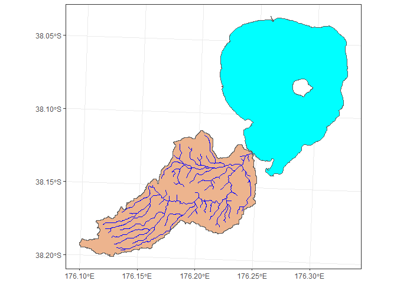
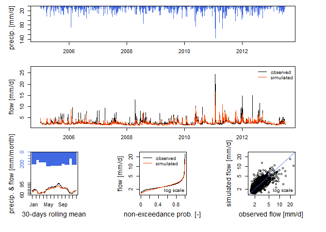

<!-- README.md is generated from README.Rmd. Please edit that file -->

# aemetools

<!-- badges: start -->

[](https://lifecycle.r-lib.org/articles/stages.html#experimental)
[](https://github.com/limnotrack/aemetools/actions/workflows/R-CMD-check.yaml)
[](https://app.codecov.io/gh/limnotrack/aemetools?branch=main)
<!-- badges: end -->

aemetools is designed to work with
[AEME](https://github.com/limnotrack/AEME/). It contains a range of
functions to assist in setting up simulations for a new lake site.

Currently, you can use this to download meteorological data from
[ERA5-Land](https://www.ecmwf.int/en/era5-land) for any point in New
Zealand from 1999-2022, or download ERA5-Land netCDF files for any area
in the world. It can set up and run hydrological simulations using the
suite of models from the [`airGR`](https://hydrogr.github.io/airGR/)
package using catchment, reach and lake data.

## Installation

You can install the development version of aemetools from
[GitHub](https://github.com/) with:

``` r
# install.packages("devtools")
devtools::install_github("limnotrack/aemetools")
```

### Download NZ point meteorological data

Currently, there is ERA5-Land data (~9km grid spacing) archived for New
Zealand (166.5/-46.6/178.6/-34.5) for the time period 1999-2022 with the
main meteorological variables (air temperature, dewpoint temperature,
wind u-vector at 10m, wind v-vector at 10m, total precipitation,
snowfall, surface level pressure, downwelling shortwave radiation,
downwelling longwave radiation) required to drive hydrological and
hydrodynamic models. This can be easily downloaded using the example
below. There is a `parallel` switch which allows you to use multiple
cores on your computer to speed up the download.

``` r
library(aemetools)

lon <- 176.2717
lat <- -38.079
variables <- c("MET_tmpair", "MET_pprain")

met <- get_era5_point(lat = lat, lon = lon, years = 2000:2001,
                      variables = variables, format = "aeme", parallel = TRUE)
#> Auto-refreshing stale OAuth token.
#> Downloading ERA5 variables in parallel... [2023-11-08 15:28:05.108454]
#> Finished downloading ERA5 variables! [2023-11-08 15:28:25.315201]
summary(met)
#>       Date              MET_tmpair       MET_pprain     
#>  Min.   :2000-01-01   Min.   : 3.407   Min.   : 0.0000  
#>  1st Qu.:2000-07-01   1st Qu.: 9.129   1st Qu.: 0.2188  
#>  Median :2000-12-30   Median :12.032   Median : 2.0354  
#>  Mean   :2000-12-30   Mean   :11.957   Mean   : 6.7384  
#>  3rd Qu.:2001-06-30   3rd Qu.:14.815   3rd Qu.: 8.3548  
#>  Max.   :2001-12-30   Max.   :19.970   Max.   :86.6961
```

### Run GR4J model

Here is simple example set up for one of the lake inflows into Lake
Rotorua. First, the input for the model are generated using the stream
ID (nzsegment), and spatial features (sf objects) of the reaches, lake
and catchment (including sub-catchments), observed discharge (if
available) meteorological data (air temperature and precipitation). It
recursively creates an upstream network using the nzsegment, then
combines the subcatchments of all the upstream reaches
(`sf::st_union()`) to calculate the area of the catchment.

``` r
data_dir <- system.file("extdata/hydro/", package = "aemetools")
lake <- readRDS(file.path(data_dir, "lake.rds"))
reaches <- readRDS(file.path(data_dir, "reaches.rds"))
catchments <- readRDS(file.path(data_dir, "catchments.rds"))
met <- readRDS(file.path(data_dir, "met.rds"))
obs_flow <- readRDS(file.path(data_dir, "obs_flow.rds"))
FUN_MOD <- airGR::RunModel_GR4J
id <- 4087861 # nzsegment

inputs <- make_GR_inputs(id = id, reaches = reaches, lake = lake,
                         catchments = catchments, obs_flow = obs_flow, met = met,
                         lat = lat, FUN_MOD = FUN_MOD,
                         plot = TRUE)
#> Warning: attribute variables are assumed to be spatially constant throughout
#> all geometries
#> Warning in make_GR_inputs(id = id, reaches = reaches, lake = lake, catchments =
#> catchments, : NA values present. Selecting period with less NA's.
```



Within the `airGR` package, there are calibration algorithms which
allows you to calibrate the hydrological model if discharge data for the
reach is available. The calibrated parameters can be passed to the
`run_GR` function to run the selected model.

``` r
#' airGR uses indices to run the model, so first we split our observed data in 
#' half (0.5) for calibration and validation periods based on when the 
#' observation data starts (which is provided in `inputs$data$start`).
idx_spl <- floor(nrow(inputs$data[inputs$start:nrow(inputs$data), ])
                 * 0.5)
#' Use a model warmup period as everything before when the observations start.
warmup <- 1:(inputs$start - 1)

# Set the indices for the calibration period
cal_idx <- inputs$start:(idx_spl + inputs$start)

# Run the calibration and assign the output
calib <- calib_GR(inputs = inputs, warmup = warmup, run_index = cal_idx)
#> Grid-Screening in progress (0% 20% 40% 60% 80% 100%)
#>   Screening completed (81 runs)
#>       Param =  432.681,   -2.376,   83.096,    2.384
#>       Crit. NSE[Q]       = -12.8326
#> Steepest-descent local search in progress
#>   Calibration completed (30 iterations, 289 runs)
#>       Param = 21807.299,   -9.151,  104.585,    2.003
#>       Crit. NSE[Q]       = 0.4836

# Extract the calibrated parameters
param <- calib$ParamFinalR

# Run the model
output <- run_GR(inputs = inputs, param = param,
                 warmup = warmup, run_index = cal_idx)

# Plot the output
plot(output, Qobs = inputs$data$Qmm[cal_idx])
```


