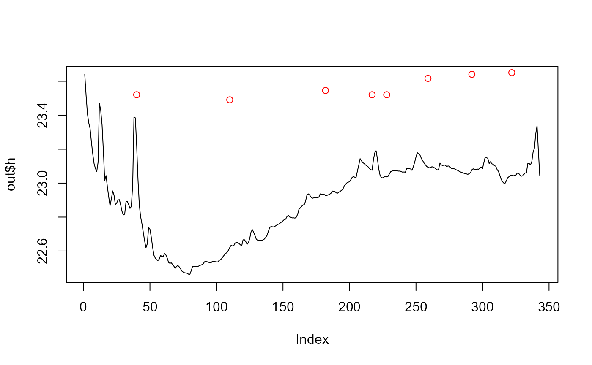
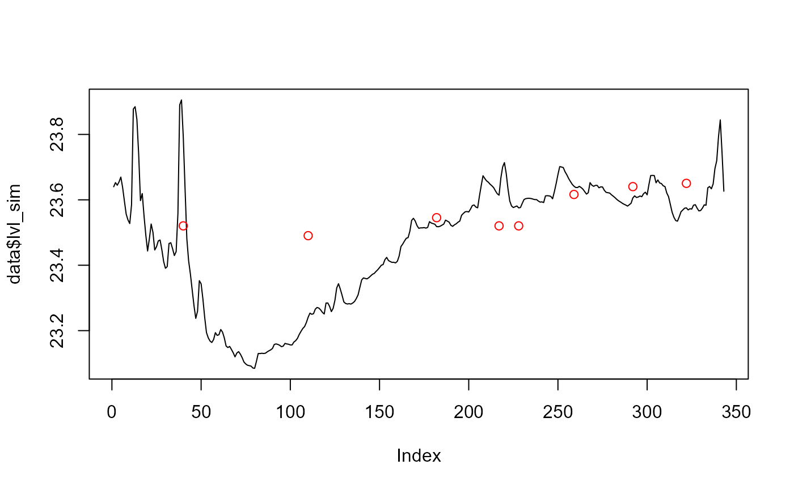

# Calibrate AEME

## Setup

First, we will load the `AEME` and `aemetools` package:

``` r
library(AEME)
library(aemetools)
```

Create a folder for running the example calibration setup.

``` r

# tmpdir <- "calib-test"
# dir.create(tmpdir, showWarnings = FALSE)
tmpdir <- tempdir()
aeme_dir <- system.file("extdata/lake/", package = "AEME")
# Copy files from package into tempdir
file.copy(aeme_dir, tmpdir, recursive = TRUE)
#> [1] TRUE
path <- file.path(tmpdir, "lake")

list.files(path, recursive = TRUE)
#> [1] "aeme.yaml"            "data/hypsograph.csv"  "data/inflow_FWMT.csv"
#> [4] "data/lake_obs.csv"    "data/meteo.csv"       "data/outflow.csv"    
#> [7] "data/water_level.csv" "model_controls.csv"
```

## Build AEME ensemble

Using the `AEME` functions, we will build the AEME model setup. For this
example, we will use the `glm_aed` model. The `build_aeme` function will

``` r

aeme <- yaml_to_aeme(path = path, "aeme.yaml")
model_controls <- AEME::get_model_controls()
inf_factor = c("dy_cd" = 1, "glm_aed" = 1, "gotm_wet" = 1)
outf_factor = c("dy_cd" = 1, "glm_aed" = 1, "gotm_wet" = 1)
model <- c("glm_aed")
aeme <- build_aeme(path = path, aeme = aeme, model = model, 
                   model_controls = model_controls, inf_factor = inf_factor, 
                   ext_elev = 5, use_bgc = FALSE)
#> Parameters: C = 0.5 , h_inv = 22.9904
```



    #> Parameters: C = 0.5 , h_inv = 22.9904 
    #> Parameters: C = 0.501 , h_inv = 22.9904 
    #> Parameters: C = 0.499 , h_inv = 22.9904 
    #> Parameters: C = 0.5 , h_inv = 22.9914 
    #> Parameters: C = 0.5 , h_inv = 22.9894 
    #> Parameters: C = 0.2661 , h_inv = 23.6504 
    #> Parameters: C = 0.2671 , h_inv = 23.6504 
    #> Parameters: C = 0.2651 , h_inv = 23.6504 
    #> Parameters: C = 0.2661 , h_inv = 23.6504 
    #> Parameters: C = 0.2661 , h_inv = 23.6494 
    #> Parameters: C = 0.3939 , h_inv = 23.3644 
    #> Parameters: C = 0.3949 , h_inv = 23.3644 
    #> Parameters: C = 0.3929 , h_inv = 23.3644 
    #> Parameters: C = 0.3939 , h_inv = 23.3654 
    #> Parameters: C = 0.3939 , h_inv = 23.3634 
    #> Parameters: C = 0.3311 , h_inv = 23.5049 
    #> Parameters: C = 0.3321 , h_inv = 23.5049 
    #> Parameters: C = 0.3301 , h_inv = 23.5049 
    #> Parameters: C = 0.3311 , h_inv = 23.5059 
    #> Parameters: C = 0.3311 , h_inv = 23.5039 
    #> Parameters: C = 0.3395 , h_inv = 23.4794 
    #> Parameters: C = 0.3405 , h_inv = 23.4794 
    #> Parameters: C = 0.3385 , h_inv = 23.4794 
    #> Parameters: C = 0.3395 , h_inv = 23.4804 
    #> Parameters: C = 0.3395 , h_inv = 23.4784 
    #> Parameters: C = 0.3355 , h_inv = 23.4916 
    #> Parameters: C = 0.3365 , h_inv = 23.4916 
    #> Parameters: C = 0.3345 , h_inv = 23.4916 
    #> Parameters: C = 0.3355 , h_inv = 23.4926 
    #> Parameters: C = 0.3355 , h_inv = 23.4906



Run the model ensemble using the `run_aeme` function to make sure the
current model setup is working.

``` r
aeme <- run_aeme(aeme = aeme, model = model, verbose = FALSE, 
                 path = path)
#> ℹ Running models... (Have you tried parallelizing?) [2026-01-20 21:53:53]
#> → GLM-AED running... [2026-01-20 21:53:53]
#> ✔ GLM-AED run successful! [2026-01-20 21:53:53]
#> ✔ Model run complete! [2026-01-20 21:53:53]
plot(aeme)
#> ! Variable 'HYD_temp' not in output for model(s): 
#> dy_cd, gotm_wet
```


Water temperature contour plotfor the model output.

## Load parameters to be used for the calibration

Parameters are loaded from the `aemetools` package within the
`aeme_parameters` dataframe. The parameters are stored in a data frame
with the following columns:

- `model`: The model name

- `file`: The file name of the model parameter file. For meteorological
  scaling variables, “met” is used, whereas for scaling factors for
  inflow and outflow, “inflow” an “outflow” is used accordingly.

- `name`: The parameter name

- `value`: The parameter value

- `min`: The minimum value of the parameter

- `max`: The maximum value of the parameter

- `module`: The module of the parameter

- `group`: The group of the parameter. Only used for phytoplankton and
  zooplankton parameters.

Parameters to be used for the calibration.

``` r
utils::data("aeme_parameters", package = "AEME")
aeme_parameters|>
  DT::datatable(options = list(pageLength = 4, scrollX = TRUE))
```

This dataframe can be modified to change the parameter values. For
example, we can change the `light/Kw` parameter for the `glm_aed` model
to 0.1:

``` r
aeme_parameters[aeme_parameters$model == "glm_aed" &
                  aeme_parameters$name == "light/Kw", "value"] <- 0.1
aeme_parameters
```

| model    | file          | name                               |   value |    min |      max | group | index | module       |
|:---------|:--------------|:-----------------------------------|--------:|-------:|---------:|:------|------:|:-------------|
| glm_aed  | glm3.nml      | light/Kw                           | 1.0e-01 |  0.100 | 5.52e+00 | NA    |    NA | hydrodynamic |
| glm_aed  | met           | MET_wndspd                         | 1.0e+00 |  0.700 | 1.30e+00 | NA    |    NA | hydrodynamic |
| glm_aed  | met           | MET_radswd                         | 1.0e+00 |  0.700 | 1.30e+00 | NA    |    NA | hydrodynamic |
| glm_aed  | glm3.nml      | mixing/coef_mix_conv               | 1.4e-01 |  0.100 | 2.00e-01 | NA    |    NA | hydrodynamic |
| glm_aed  | glm3.nml      | mixing/coef_wind_stir              | 2.1e-01 |  0.200 | 3.00e-01 | NA    |    NA | hydrodynamic |
| glm_aed  | glm3.nml      | mixing/coef_mix_shear              | 1.4e-01 |  0.100 | 2.00e-01 | NA    |    NA | hydrodynamic |
| glm_aed  | glm3.nml      | mixing/coef_mix_turb               | 5.6e-01 |  0.200 | 7.00e-01 | NA    |    NA | hydrodynamic |
| glm_aed  | glm3.nml      | mixing/coef_mix_hyp                | 7.4e-01 |  0.400 | 8.00e-01 | NA    |    NA | hydrodynamic |
| glm_aed  | glm3.nml      | sediment/n_zones                   | 1.0e+00 |  1.000 | 1.00e+00 | NA    |    NA | sediment     |
| glm_aed  | glm3.nml      | sediment/sed_temp_mean             | 1.2e+01 |  6.000 | 1.80e+01 | NA    |     1 | sediment     |
| glm_aed  | glm3.nml      | sediment/sed_temp_peak_doy         | 3.0e+01 |  1.000 | 9.00e+01 | NA    |     1 | sediment     |
| glm_aed  | wdr           | outflow                            | 1.0e+00 |  0.500 | 2.50e+00 | NA    |    NA | hydrodynamic |
| glm_aed  | inf           | inflow                             | 1.0e+00 |  0.500 | 2.50e+00 | NA    |    NA | hydrodynamic |
| gotm_wet | gotm.yaml     | turbulence/turb_param/k_min        | 6.0e-07 |  0.000 | 1.00e-05 | NA    |    NA | hydrodynamic |
| gotm_wet | gotm.yaml     | light_extinction/A/constant_value  | 5.5e-01 |  0.395 | 6.59e-01 | NA    |    NA | hydrodynamic |
| gotm_wet | gotm.yaml     | light_extinction/g1/constant_value | 5.9e-01 |  0.440 | 7.40e-01 | NA    |    NA | hydrodynamic |
| gotm_wet | gotm.yaml     | light_extinction/g2/constant_value | 2.0e-01 |  0.050 | 2.70e+00 | NA    |    NA | hydrodynamic |
| gotm_wet | met           | MET_wndspd                         | 1.0e+00 |  0.700 | 1.30e+00 | NA    |    NA | hydrodynamic |
| gotm_wet | met           | MET_radswd                         | 1.0e+00 |  0.700 | 1.30e+00 | NA    |    NA | hydrodynamic |
| gotm_wet | wdr           | outflow                            | 1.0e+00 |  0.500 | 2.50e+00 | NA    |    NA | hydrodynamic |
| gotm_wet | inf           | inflow                             | 1.0e+00 |  0.500 | 2.50e+00 | NA    |    NA | hydrodynamic |
| dy_cd    | cfg           | light_extinction_coefficient/7     | 9.0e-01 |  0.100 | 1.40e+00 | NA    |    NA | hydrodynamic |
| dy_cd    | dyresm3p1.par | vert_mix_coeff/15                  | 2.0e+02 | 50.000 | 7.50e+02 | NA    |    NA | hydrodynamic |
| dy_cd    | met           | MET_wndspd                         | 1.0e+00 |  0.700 | 1.30e+00 | NA    |    NA | hydrodynamic |
| dy_cd    | met           | MET_radswd                         | 1.0e+00 |  0.700 | 1.30e+00 | NA    |    NA | hydrodynamic |
| dy_cd    | wdr           | outflow                            | 1.0e+00 |  0.500 | 2.50e+00 | NA    |    NA | hydrodynamic |
| dy_cd    | inf           | inflow                             | 1.0e+00 |  0.500 | 2.50e+00 | NA    |    NA | hydrodynamic |

This dataframe can be passed to the `run_aeme_param` function to run
AEME with the parameter values specified in the dataframe. This function
is different to the `run_aeme` function in that it does not return an
`aeme` object, but the model output is generated within the lake folder.

``` r
run_aeme_param(aeme = aeme, param = aeme_parameters,
                 model = model, path = path)
#> ℹ Deleted previous output for model GLM-AED at
#>   C:/Users/runneradmin/AppData/Local/Temp/RtmpqkBRss/lake/45819_wainamu/glm_aed/output/output.nc
#> ℹ Running models... (Have you tried parallelizing?) [2026-01-20 21:53:56]
#> → GLM-AED running... [2026-01-20 21:53:56]
#> ✔ GLM-AED run successful! [2026-01-20 21:53:56]
#> ✔ Model run complete! [2026-01-20 21:53:56]
```

## Calibration setup

### Choosing variables to calibrate

Choosing which variables to calibrate is an important step in the
calibration process. The variables to calibrate are usually selected
based on the availability of data and the importance of the variable to
the model.

There is a function within the `AEME` package called `get_mod_obs_vars`
which can be used to get the available variables for which there is
modelled and observed data.

``` r
available_vars <- AEME::get_mod_obs_vars(aeme = aeme, model = model)
available_vars
```

| var_aeme   |   n | n_depth | n_dates |
|:-----------|----:|--------:|--------:|
| CHM_salt   | 125 |      13 |      10 |
| HYD_ctrbuy |  10 |       1 |      10 |
| HYD_epidep |   7 |       1 |       7 |
| HYD_hypdep |   7 |       1 |       7 |
| HYD_schstb |  10 |       1 |      10 |
| HYD_strat  |  10 |       1 |      10 |
| HYD_temp   | 125 |      13 |      10 |
| HYD_thmcln |  10 |       1 |      10 |

There are 10 variables available for calibration, this includes derived
variables such as thermocline depth (HYD_thmcln) and Schmidt stability
(HYD_schstb).

For this example, we will calibrate the water temperature and lake
level. The variables are selected using the AEME variable definition
e.g. `c("HYD_temp", "LKE_lvlwtr")`.

``` r
vars_sim <- c("HYD_temp", "LKE_lvlwtr")
```

### Define fitness function

First, we will define a function for the calibration function to use to
calculate the fitness of the model. This function takes a dataframe as
an argument. The dataframe contains the observed data (`obs`) and the
modelled data (`model`). The function should return a single value.

Here we use the root mean square error (RMSE) as the fitness function:

$$\text{RMSE}\left( y,\widehat{y} \right) = \sqrt{\frac{\sum\limits_{i = 0}^{N - 1}\left( y_{i} - {\widehat{y}}_{i} \right)^{2}}{N}}$$

``` r
# Function to calculate fitness
rmse <- function(df) {
  sqrt(mean((df$obs - df$model)^2))
}
```

Different functions can be applied to different variables. For example,
we can use the RMSE for the lake level and the mean absolute error (MAE)
for the water temperature:

``` r
# Function to calculate fitness
mae <- function(df) {
  mean(abs(df$obs - df$model))
}
```

Then these would be combined into a named list of functions which will
be passed to the `calib_aeme` function. They are named according to the
target variable.

``` r
# Create list of functions
FUN_list <- list(HYD_temp = mae, LKE_lvlwtr = rmse)
```

### Define control parameters

Next, we will define the control parameters for the calibration. The
control parameters are generated using the `create_control` funtion and
are then passed to the `calib_aeme` function. The control parameters for
calibration are as follows:

``` r
?create_control
```

|                |                 |
|----------------|----------------:|
| create_control | R Documentation |

## Create control list for calibration or sensitivity analysis

### Arguments

[TABLE]

Here is an example of the control parameters for calibration, with a
value-to-reach of 0, 40 members in each population, maximum number of
iterations of 400, a relative tolerance of 0.07, 25% of parameters in
each population need to be non-NA to be used as parents in the next
generation, 10% of the children parameters undergo random mutation,
parallel processing is used, the file type for writing the results is
CSV, the NA value is 999 and 2 cores are used for parallel processing.
The control parameters are stored in the `ctrl` object which is then
passed to the `calib_aeme` function.

``` r
ctrl <- create_control(method = "calib", VTR = 0, NP = 40, itermax = 400, 
                       reltol = 0.07, cutoff = 0.25, mutate = 0.1, 
                       parallel = TRUE, file_type = "csv", 
                       na_value = 999, ncore = 2)
```

### Define variable weights

Weights need to be attributed to each of the selected variables. The
weights are used to scale the fitness value. This can be helpful if the
variables have different units. For example, if the temperature is in
degrees Celsius and the water level is in metres, then the water level
will have a much larger impact on the fitness value. Therefore, the
weight for the water level should be much smaller than the weight for
the temperature.

The weights are specified in a named vector. The names of the vector
should be the same as the variable names.

``` r
weights <- c("HYD_temp" = 1, "LKE_lvlwtr" = 0.1)
```

## Run calibration

Once we have defined the fitness function, control parameters and
variables, we can run the calibration. The `calib_aeme` function takes
the following arguments:

``` r
?calib_aeme
```

|            |                 |
|------------|----------------:|
| calib_aeme | R Documentation |

## Calibrate AEME model parameters using observations

### Arguments

|                  |                                                                                                                                                                                                            |
|------------------|------------------------------------------------------------------------------------------------------------------------------------------------------------------------------------------------------------|
| `aeme`           | aeme; object.                                                                                                                                                                                              |
| `model`          | vector; of models to be used. Can be 'dy_cd', 'glm_aed', 'gotm_wet'.                                                                                                                                       |
| `param`          | dataframe; of parameters read in from a csv file. Requires the columns c("model", "file", "name", "value", "min", "max", "log")                                                                            |
| `vars_sim`       | vector; of variables names to be used in the calculation of model fit.                                                                                                                                     |
| `FUN_list`       | list of functions; named according to the variables in the `vars_sim`. Funtions are of the form `⁠function(df)⁠` which will be used to calculate model fit. If nor provided, uses mean absolute error (MAE). |
| `weights`        | vector; of weights for each variable in vars_sim. If not provided, defaults to 1 for each variable.                                                                                                        |
| `path`           | filepath; where input files are located relative to the current working directory.                                                                                                                         |
| `model_controls` | dataframe; of configuration loaded from "model_controls.csv".                                                                                                                                              |
| `ctrl`           | list; of controls for sensitivity analysis function created using the `create_control` function. See create_control for more details.                                                                      |
| `param_df`       | dataframe; of parameters to be used in the calibration. Requires the columns c("model", "file", "name", "value", "min", "max"). This is used to restart from a previous calibration.                       |

The `calib_aeme` function writes the calibration results to the file
specified after each generation. This allows the calibration to be
stopped and restarted at any time. The `calib_aeme` function returns the
`ctrl` object with any updated values.

``` r
sim_id <- calib_aeme(aeme = aeme, path = path,
                     param = aeme_parameters, model = model,
                     FUN_list = FUN_list, ctrl = ctrl, 
                     vars_sim = vars_sim, weights = weights)
#> ℹ Variables not found: `LKE_lvlwtr`.
#> Adding them to model_controls.
#> ℹ Extracting indices for "glm_aed" modelled variables [2026-01-20 21:53:58]
#> ✔ Indices extracted for "glm_aed" modelled variables [2026-01-20 21:53:58]
#> ℹ Using 2 cores for parallel calibration for "glm_aed".
#> → Starting generation 1/10, 40 members. [2026-01-20 21:53:59]
#> Parameter summary for generation 1:
#> ✔ Completed generation 1/10 
#> for "glm_aed". [2026-01-20 21:54:28]
#> 
#> Best fit: 0.965 (sd: 450.95) Parameters: [ 4.32, 1.07, 1.18, 0.168, 0.211,
#> 0.102, 0.45, 0.587, 1, 12.8, 54.9, 1.71, and 1.74 ]
#> Writing output for generation 1 to simulation_data.csv with sim ID:
#> "45819_glmaed_C_001" [2026-01-20 21:54:28]
#> ℹ Survival rate: 0.72
#> 
#> → Starting generation 2/10, 40 members. [2026-01-20 21:54:28]
#> Parameter summary for generation 2:
#> Writing output for generation 2 to simulation_data.csv with sim ID:
#> "45819_glmaed_C_001" [2026-01-20 21:54:49]
#> ✔ Completed generation 2/10 
#> for "glm_aed". [2026-01-20 21:54:49]
#> 
#> Best fit: 0.96515 (sd: 220.18)
#> ℹ Survival rate: 0.95
#> 
#> → Starting generation 3/10, 40 members. [2026-01-20 21:54:49]
#> Parameter summary for generation 3:
#> Writing output for generation 3 to simulation_data.csv with sim ID:
#> "45819_glmaed_C_001" [2026-01-20 21:55:10]
#> ✔ Completed generation 3/10 
#> for "glm_aed". [2026-01-20 21:55:10]
#> 
#> Best fit: 0.77571 (sd: 157.75)
#> ℹ Survival rate: 0.98
#> 
#> → Starting generation 4/10, 40 members. [2026-01-20 21:55:10]
#> Parameter summary for generation 4:
#> Writing output for generation 4 to simulation_data.csv with sim ID:
#> "45819_glmaed_C_001" [2026-01-20 21:55:33]
#> ✔ Completed generation 4/10 
#> for "glm_aed". [2026-01-20 21:55:33]
#> 
#> Best fit: 0.77571 (sd: 266.19)
#> ℹ Survival rate: 0.92
#> 
#> → Starting generation 5/10, 40 members. [2026-01-20 21:55:33]
#> Parameter summary for generation 5:
#> Writing output for generation 5 to simulation_data.csv with sim ID:
#> "45819_glmaed_C_001" [2026-01-20 21:55:54]
#> ✔ Completed generation 5/10 
#> for "glm_aed". [2026-01-20 21:55:54]
#> 
#> Best fit: 0.75462 (sd: 220.29)
#> ℹ Survival rate: 0.95
#> 
#> → Starting generation 6/10, 40 members. [2026-01-20 21:55:54]
#> Parameter summary for generation 6:
#> Writing output for generation 6 to simulation_data.csv with sim ID:
#> "45819_glmaed_C_001" [2026-01-20 21:56:14]
#> ✔ Completed generation 6/10 
#> for "glm_aed". [2026-01-20 21:56:15]
#> 
#> Best fit: 0.7334 (sd: 220.29)
#> ℹ Survival rate: 0.95
#> 
#> → Starting generation 7/10, 40 members. [2026-01-20 21:56:15]
#> Parameter summary for generation 7:
#> Writing output for generation 7 to simulation_data.csv with sim ID:
#> "45819_glmaed_C_001" [2026-01-20 21:56:37]
#> ✔ Completed generation 7/10 
#> for "glm_aed". [2026-01-20 21:56:37]
#> 
#> Best fit: 0.7334 (sd: 220.31)
#> ℹ Survival rate: 0.95
#> 
#> → Starting generation 8/10, 40 members. [2026-01-20 21:56:37]
#> Parameter summary for generation 8:
#> Writing output for generation 8 to simulation_data.csv with sim ID:
#> "45819_glmaed_C_001" [2026-01-20 21:56:56]
#> ✔ Completed generation 8/10 
#> for "glm_aed". [2026-01-20 21:56:56]
#> 
#> Best fit: 0.7334 (sd: 303.26)
#> ℹ Survival rate: 0.9
#> 
#> → Starting generation 9/10, 40 members. [2026-01-20 21:56:56]
#> Parameter summary for generation 9:
#> Writing output for generation 9 to simulation_data.csv with sim ID:
#> "45819_glmaed_C_001" [2026-01-20 21:57:17]
#> ✔ Completed generation 9/10 
#> for "glm_aed". [2026-01-20 21:57:17]
#> 
#> Best fit: 0.7334 (sd: 220.31)
#> ℹ Survival rate: 0.95
#> 
#> → Starting generation 10/10, 40 members. [2026-01-20 21:57:17]
#> Parameter summary for generation 10:
#> Writing output for generation 10 to simulation_data.csv with sim ID:
#> "45819_glmaed_C_001" [2026-01-20 21:57:42]
#> ✔ Completed generation 10/10 
#> for "glm_aed". [2026-01-20 21:57:42]
#> 
#> Best fit: 0.7334 (sd: 220.31)
#> ℹ Survival rate: 0.95
```

## Visualise calibration results

The calibrations results can be read in using the `read_calib` function.
This function takes the following arguments:

``` r
?read_calib
```

|                        |                 |
|------------------------|----------------:|
| read_simulation_output | R Documentation |

## Read calibration output

### Arguments

|             |                                                                                                                                                                                                            |
|-------------|------------------------------------------------------------------------------------------------------------------------------------------------------------------------------------------------------------|
| `ctrl`      | list; of controls for sensitivity analysis function created using the `create_control` function. See create_control for more details.                                                                      |
| `file_name` | The name of the output file. If `ctrl` is provided, this argument is ignored.                                                                                                                              |
| `file_dir`  | The directory of the output file. If `ctrl` is provided, this argument is ignored.                                                                                                                         |
| `sim_id`    | A vector of simulation IDs to read. If NULL, all simulations are read.                                                                                                                                     |
| `type`      | A character string indicating the type of simulation. One of "calib", "sa", or "all". If missing, the type is inferred from the `ctrl` argument. If type is provided it overrides the `ctrl$method` value. |

The `read_calib` function returns a dataframe with the calibration
results. The calibration results include the model, generation, index
(model run), parameter name, parameter value, fitness value and the
median fitness value for each generation.

These results can be visualised using the `plot_calib` function. This
function takes the following arguments:

- `calib`: The calibration results as read in using the `read_calib`
  function.
- `model`: The model used for the calibration.
- `ctrl`: The control parameters used for the calibration.

And returns a list of ggplot objects: a dotty plot, density plot and
convergence plot.

``` r

calib <- read_calib(ctrl = ctrl, sim_id = sim_id)
plist <- plot_calib(calib = calib, na_value = ctrl$na_value)
```

### Dotty plot

This can be used for comparing sensitivity across parameters. The dotty
plot shows the fitness value for each parameter value for each
generation. The fitness value is on the y-axis and the parameter value
is on the x-axis. It is faceted by the parameter name. The parameter
values are coloured by the generation. The best fitness value for each
generation is shown as a black line with a red dot.

``` r
plist$dotty
```


### Histogram plot

This is useful for comparing the distribution of parameter values across
generations. The histogram plot shows the frequency of the parameter
values for each generation. The parameter values are on the x-axis and
the density is on the y-axis. It is faceted by the parameter name.

If a parameter is converging on a value, then the histogram will show a
peak around that value. If a parameter is not converging on a value,
then the histogram will show a flat distribution.

``` r
plist$hist
```


### Convergence plot

This is more generally used for assessing model convergence. The
convergence plot shows the values use over the iterations. The parameter
value is on the y-axis and the iteration is on the x-axis. It is faceted
by the parameter name. The parameter values are coloured by the
generation. The best fitness value for each generation is shown as a
solid horizontal black line.

``` r
plist$convergence
```


## Assess calibrated values

The best parameter values can be extracted using the `get_param`
function. This function takes the following arguments:

- `calib`: The calibration results as read in using the `read_calib`
  function.
- `na_value`: The value to use for missing values in the observed and
  predicted data. This is used to indicate when the model crashes and
  then can be easily removed from the calibration results.
- `fit_col`: The name of the column in the calibration results that
  contains the fitness value. Defaults to `fit`.
- `best`: A logical indicating whether to return the best parameter
  values or the entire calibration dataset. Defaults to `FALSE`.

``` r
best_params <- get_param(calib, na_value = ctrl$na_value, fit_col = "fit", 
                         best = TRUE)
best_params
```

| sim_id             | model   | file     | name                       |     value |       min |       max | group | index | fit_value | gen | fit_type |
|:-------------------|:--------|:---------|:---------------------------|----------:|----------:|----------:|:------|------:|----------:|:----|:---------|
| 45819_glmaed_C_001 | glm_aed | met      | MET_radswd                 |  1.068450 |  1.068450 |  1.068450 | NA    |    NA |  0.733397 | 1   | fit      |
| 45819_glmaed_C_001 | glm_aed | met      | MET_wndspd                 |  1.022040 |  1.022040 |  1.022040 | NA    |    NA |  0.733397 | 1   | fit      |
| 45819_glmaed_C_001 | glm_aed | inf      | inflow                     |  1.301250 |  1.301250 |  1.301250 | NA    |    NA |  0.733397 | 1   | fit      |
| 45819_glmaed_C_001 | glm_aed | glm3.nml | light/Kw                   |  1.422550 |  1.422550 |  1.422550 | NA    |    NA |  0.733397 | 1   | fit      |
| 45819_glmaed_C_001 | glm_aed | glm3.nml | mixing/coef_mix_conv       |  0.179170 |  0.179170 |  0.179170 | NA    |    NA |  0.733397 | 1   | fit      |
| 45819_glmaed_C_001 | glm_aed | glm3.nml | mixing/coef_mix_hyp        |  0.594301 |  0.594301 |  0.594301 | NA    |    NA |  0.733397 | 1   | fit      |
| 45819_glmaed_C_001 | glm_aed | glm3.nml | mixing/coef_mix_shear      |  0.125066 |  0.125066 |  0.125066 | NA    |    NA |  0.733397 | 1   | fit      |
| 45819_glmaed_C_001 | glm_aed | glm3.nml | mixing/coef_mix_turb       |  0.543457 |  0.543457 |  0.543457 | NA    |    NA |  0.733397 | 1   | fit      |
| 45819_glmaed_C_001 | glm_aed | glm3.nml | mixing/coef_wind_stir      |  0.288264 |  0.288264 |  0.288264 | NA    |    NA |  0.733397 | 1   | fit      |
| 45819_glmaed_C_001 | glm_aed | wdr      | outflow                    |  1.289700 |  1.289700 |  1.289700 | NA    |    NA |  0.733397 | 1   | fit      |
| 45819_glmaed_C_001 | glm_aed | glm3.nml | sediment/n_zones           |  1.000000 |  1.000000 |  1.000000 | NA    |    NA |  0.733397 | 1   | fit      |
| 45819_glmaed_C_001 | glm_aed | glm3.nml | sediment/sed_temp_mean     | 13.358700 | 13.358700 | 13.358700 | NA    |     1 |  0.733397 | 1   | fit      |
| 45819_glmaed_C_001 | glm_aed | glm3.nml | sediment/sed_temp_peak_doy | 58.646100 | 58.646100 | 58.646100 | NA    |     1 |  0.733397 | 1   | fit      |

The best parameter values can be used to run the model and compare the
simulated values to the observed values. This can be done using the
`run_aeme_param` function.

``` r
aeme <- run_aeme_param(aeme = aeme, path = path,
                       param = best_params, model = model,
                       return_aeme = TRUE)
#> ℹ Deleted previous output for model GLM-AED at
#>   C:/Users/runneradmin/AppData/Local/Temp/RtmpqkBRss/lake/45819_wainamu/glm_aed/output/output.nc
#> ℹ Running models... (Have you tried parallelizing?) [2026-01-20 21:57:49]
#> → GLM-AED running... [2026-01-20 21:57:49]
#> ✔ GLM-AED run successful! [2026-01-20 21:57:49]
#> ✔ Model run complete! [2026-01-20 21:57:49]
```

The simulated values can be compared to the observed values using the
`assess_model` function. This function takes the following arguments:

- `aeme`: The `aeme` object which has observations and model
  simulations.
- `model`: The model to assess.
- `var_sim`: The variables to use for the assessment.

The `assess_model` function returns:

``` r
?assess_model
```

|              |                 |
|--------------|----------------:|
| assess_model | R Documentation |

## Assess model performance

### Value

Data frame with model performance statistics for each model and
variable. These include:

- bias - Bias

- mae - Mean absolute error

- rmse - Root mean square error

- nmae - Normalised mean absolute error

- nse - Nash-Sutcliffe efficiency

- d2 - Index of agreement model skill score Willmott index

- r - Pearson correlation coefficient

- rs - Spearman correlation coefficient

- r2 - R-squared value from linear model

- B - Bardsley coefficient

- n - number of observations

``` r

assess_model(aeme = aeme, model = model, var_sim = vars_sim)
```

| Model   | var_sim    |   bias |   mae |  rmse |  nmae |     nse |    d2 |      r |     rs |    r2 |     B |   n | obs_na | sim_na | name_text         | name_parse              |
|:--------|:-----------|-------:|------:|------:|------:|--------:|------:|-------:|-------:|------:|------:|----:|-------:|-------:|:------------------|:------------------------|
| GLM-AED | HYD_temp   |  0.008 | 0.715 | 1.015 | 0.040 |   0.894 | 0.052 |  0.947 |  0.945 | 0.897 | 0.811 | 125 |      0 |      0 | Water temperature | Temperature_((degree)C) |
| GLM-AED | LKE_lvlwtr | -0.029 | 0.161 | 0.210 | 0.007 | -11.842 | 3.469 | -0.063 | -0.195 | 0.004 | 0.000 |   8 |      0 |      0 | Water level       | Water_(level)(m)        |

### Visualise model performance

The model performance can be visualised using the `plot_resid` function
within the AEME package. This returns a list of ggplot objects, a plot
of residuals for each variable. This is a multi-panel plot displaying
residuals for:

- Observed vs. predicted values
- Residuals vs. predicted values
- Residuals vs. day of year
- Residuals vs. quantiles of the observed values

``` r
pl <- plot_resid(aeme = aeme, model = model, var_sim = vars_sim)
```

#### Water temperature residuals

``` r

pl$HYD_temp
```


#### Lake level residuals

``` r

pl$LKE_lvlwtr
#> Ignoring unknown labels:
#> • colour : ""
#> Ignoring unknown labels:
#> • colour : ""
```


