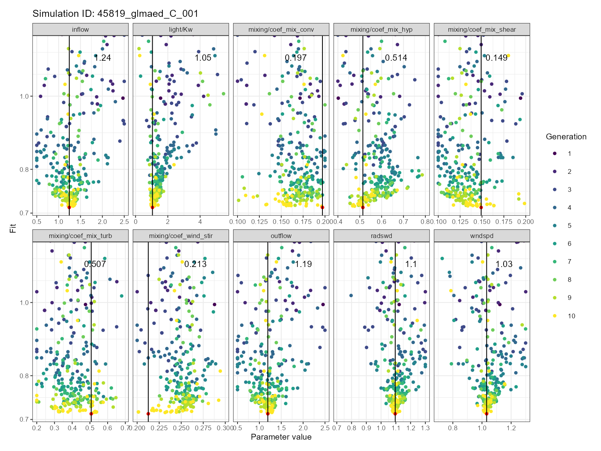
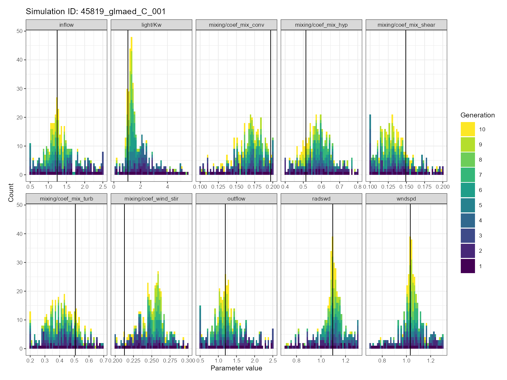
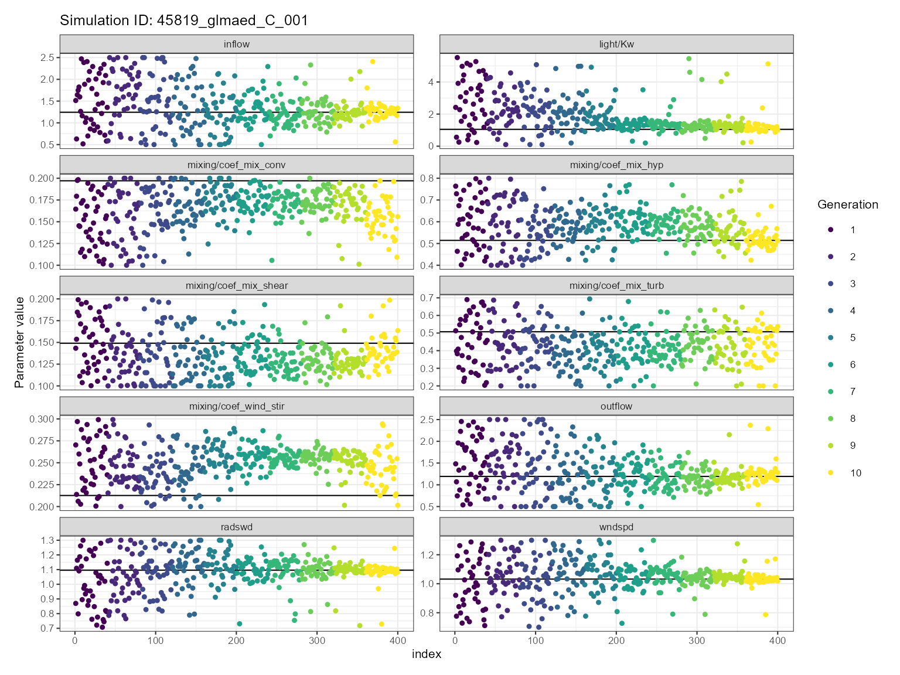
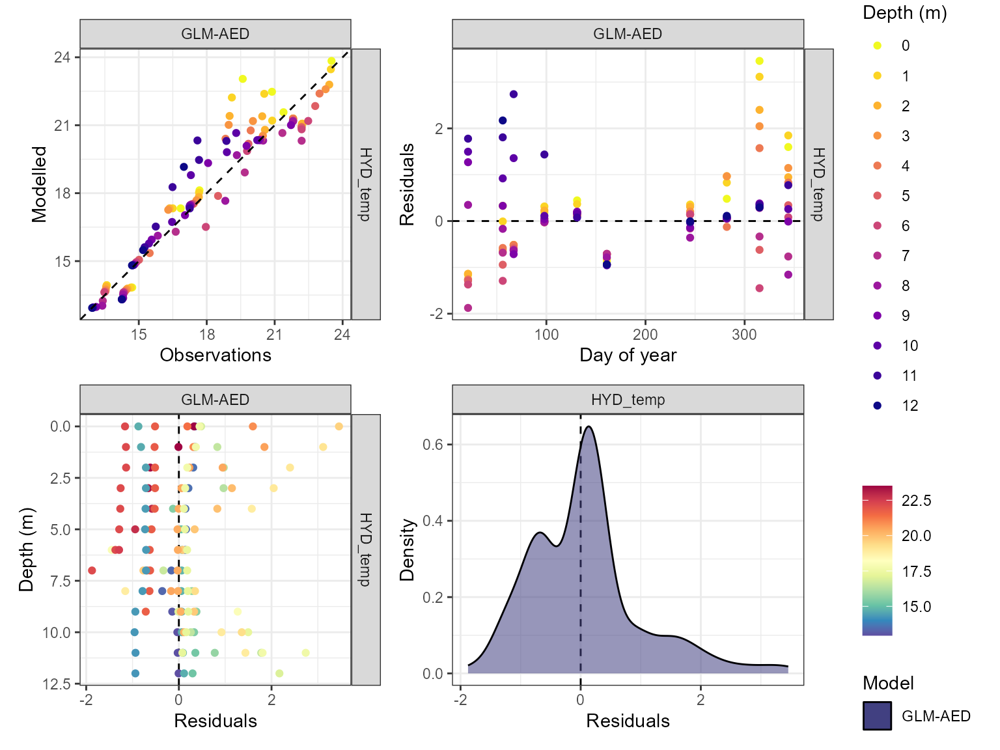
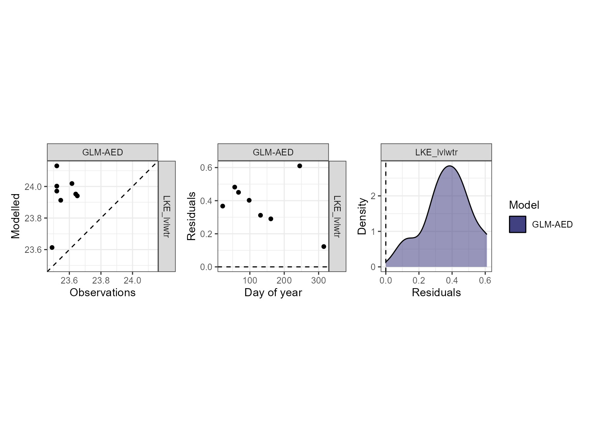

# Calibrate AEME

## Setup

First, we will load the `AEME` and `aemetools` package:

``` r
library(AEME)
library(aemetools)
```

Create a folder for running the example calibration setup.

``` r

# tmpdir <- "calib-test"
# dir.create(tmpdir, showWarnings = FALSE)
tmpdir <- tempdir()
aeme_dir <- system.file("extdata/lake/", package = "AEME")
# Copy files from package into tempdir
file.copy(aeme_dir, tmpdir, recursive = TRUE)
#> [1] TRUE
path <- file.path(tmpdir, "lake")

list.files(path, recursive = TRUE)
#> [1] "aeme.yaml"            "data/hypsograph.csv"  "data/inflow_FWMT.csv"
#> [4] "data/lake_obs.csv"    "data/meteo.csv"       "data/outflow.csv"    
#> [7] "data/water_level.csv" "model_controls.csv"
```

## Build AEME ensemble

Using the `AEME` functions, we will build the AEME model setup. For this
example, we will use the `glm_aed` model. The `build_aeme` function will
build the model setup and the `run_aeme` function will run the model.
The model output is stored in the lake folder.

Note that `AEME` funtions can be used in pipelines to allow for more
efficient code. For example, the `build_aeme` function can be used in a
pipeline with the `run_aeme` function to build and run the model in one
step.

``` r

aeme <- yaml_to_aeme(path = path, "aeme.yaml")
model_controls <- AEME::get_model_controls()
model <- c("glm_aed")
aeme <- build_aeme(path = path, aeme = aeme, model = model, 
                   model_controls = model_controls, inf_factor = inf_factor, 
                   ext_elev = 5, use_bgc = FALSE) |> 
  run_aeme()
```

``` r
plot(aeme)
```


Water temperature contour plotfor the model output.

## Load parameters to be used for the calibration

Parameters are loaded from the `aemetools` package within the
`aeme_parameters` dataframe. The parameters are stored in a data frame
with the following columns:

- `model`: The model name

- `file`: The file name of the model parameter file. For meteorological
  scaling variables, “met” is used, whereas for scaling factors for
  inflow and outflow, “inflow” an “outflow” is used accordingly.

- `name`: The parameter name

- `value`: The parameter value

- `min`: The minimum value of the parameter

- `max`: The maximum value of the parameter

- `module`: The module of the parameter

- `group`: The group of the parameter. Only used for phytoplankton and
  zooplankton parameters.

Parameters to be used for the calibration.

``` r
utils::data("aeme_parameters", package = "AEME")
aeme_parameters|>
  DT::datatable(options = list(pageLength = 4, scrollX = TRUE))
```

This dataframe can be modified to change the parameter values. For
example, we can change the `light/Kw` parameter for the `glm_aed` model
to 0.1:

``` r
aeme_parameters[aeme_parameters$model == "glm_aed" &
                  aeme_parameters$name == "light/Kw", "value"] <- 0.1
aeme_parameters
```

| model    | file          | name                               |   value |    min |      max | group | index | module       | var_sim              |
|:---------|:--------------|:-----------------------------------|--------:|-------:|---------:|:------|:------|:-------------|:---------------------|
| glm_aed  | glm3.nml      | light/Kw                           | 1.0e-01 |  0.100 | 5.52e+00 | NA    | NA    | hydrodynamic | HYD_temp\|HYD_thmcln |
| glm_aed  | met           | MET_wndspd                         | 1.0e+00 |  0.700 | 1.30e+00 | NA    | NA    | hydrodynamic | HYD_temp\|HYD_thmcln |
| glm_aed  | met           | MET_radswd                         | 1.0e+00 |  0.700 | 1.30e+00 | NA    | NA    | hydrodynamic | HYD_temp             |
| glm_aed  | glm3.nml      | mixing/coef_mix_conv               | 1.4e-01 |  0.100 | 2.00e-01 | NA    | NA    | hydrodynamic | HYD_thmcln           |
| glm_aed  | glm3.nml      | mixing/coef_wind_stir              | 2.1e-01 |  0.200 | 3.00e-01 | NA    | NA    | hydrodynamic | HYD_thmcln           |
| glm_aed  | glm3.nml      | mixing/coef_mix_shear              | 1.4e-01 |  0.100 | 2.00e-01 | NA    | NA    | hydrodynamic | HYD_thmcln           |
| glm_aed  | glm3.nml      | mixing/coef_mix_turb               | 5.6e-01 |  0.200 | 7.00e-01 | NA    | NA    | hydrodynamic | HYD_thmcln           |
| glm_aed  | glm3.nml      | mixing/coef_mix_hyp                | 7.4e-01 |  0.400 | 8.00e-01 | NA    | NA    | hydrodynamic | HYD_thmcln           |
| glm_aed  | wdr           | outflow                            | 1.0e+00 |  0.500 | 2.50e+00 | NA    | NA    | hydrodynamic | LKE_lvlwtr           |
| glm_aed  | inf           | inflow                             | 1.0e+00 |  0.500 | 2.50e+00 | NA    | NA    | hydrodynamic | LKE_lvlwtr           |
| gotm_wet | gotm.yaml     | turbulence/turb_param/k_min        | 6.0e-07 |  0.000 | 1.00e-05 | NA    | NA    | hydrodynamic | HYD_thmcln           |
| gotm_wet | gotm.yaml     | light_extinction/A/constant_value  | 5.5e-01 |  0.395 | 6.59e-01 | NA    | NA    | hydrodynamic | HYD_temp\|HYD_thmcln |
| gotm_wet | gotm.yaml     | light_extinction/g1/constant_value | 5.9e-01 |  0.440 | 7.40e-01 | NA    | NA    | hydrodynamic | HYD_temp\|HYD_thmcln |
| gotm_wet | gotm.yaml     | light_extinction/g2/constant_value | 2.0e-01 |  0.050 | 2.70e+00 | NA    | NA    | hydrodynamic | HYD_temp\|HYD_thmcln |
| gotm_wet | met           | MET_wndspd                         | 1.0e+00 |  0.700 | 1.30e+00 | NA    | NA    | hydrodynamic | HYD_temp\|HYD_thmcln |
| gotm_wet | met           | MET_radswd                         | 1.0e+00 |  0.700 | 1.30e+00 | NA    | NA    | hydrodynamic | HYD_temp             |
| gotm_wet | wdr           | outflow                            | 1.0e+00 |  0.500 | 2.50e+00 | NA    | NA    | hydrodynamic | LKE_lvlwtr           |
| gotm_wet | inf           | inflow                             | 1.0e+00 |  0.500 | 2.50e+00 | NA    | NA    | hydrodynamic | LKE_lvlwtr           |
| dy_cd    | cfg           | light_extinction_coefficient/7     | 9.0e-01 |  0.100 | 1.40e+00 | NA    | NA    | hydrodynamic | HYD_temp\|HYD_thmcln |
| dy_cd    | dyresm3p1.par | vert_mix_coeff/15                  | 2.0e+02 | 50.000 | 7.50e+02 | NA    | NA    | hydrodynamic | HYD_thmcln           |
| dy_cd    | met           | MET_wndspd                         | 1.0e+00 |  0.700 | 1.30e+00 | NA    | NA    | hydrodynamic | HYD_temp\|HYD_thmcln |
| dy_cd    | met           | MET_radswd                         | 1.0e+00 |  0.700 | 1.30e+00 | NA    | NA    | hydrodynamic | HYD_temp             |
| dy_cd    | wdr           | outflow                            | 1.0e+00 |  0.500 | 2.50e+00 | NA    | NA    | hydrodynamic | LKE_lvlwtr           |
| dy_cd    | inf           | inflow                             | 1.0e+00 |  0.500 | 2.50e+00 | NA    | NA    | hydrodynamic | LKE_lvlwtr           |

This dataframe can be passed to the `run_aeme_param` function to run
AEME with the parameter values specified in the dataframe. This function
is different to the `run_aeme` function in that it does not return an
`aeme` object, but the model output is generated within the lake folder.

``` r
run_aeme_param(aeme = aeme, param = aeme_parameters,
                 model = model, path = path)
#> ℹ Deleted previous output for model GLM-AED at
#>   C:/Users/runneradmin/AppData/Local/Temp/RtmpG2nE5Q/lake/45819_wainamu/glm_aed/output/output.nc
#> ℹ Running models... (Have you tried parallelizing?) [2026-03-04 03:06:38]
#> → GLM-AED running... [2026-03-04 03:06:38]
#> ! GLM-AED run FAILED! [2026-03-04 03:06:38]
#>      glm built using gcc version 12.2.0
#> 
#>      nDays= 200; timestep= 3600.000000 (s)
#>      Maximum lake depth is 18.070000
#>      Depth where flow will occur over the crest is 18.070000
#> 
#>      Wall clock start time :  Wed Mar  4 03:06:38 2026
#> 
#>      Simulation begins...
#>      Running day  2459061, 0.30% of days complete     Running day  2459062, 0.60% of days complete     Running day  2459063, 0.89% of days complete     Running day  2459064, 1.19% of days complete     Running day  2459065, 1.49% of days complete     Running day  2459066, 1.79% of days complete     Running day  2459067, 2.08% of days complete     Running day  2459068, 2.38% of days complete     Running day  2459069, 2.68% of days complete     Running day  2459070, 2.98% of days complete     Running day  2459071, 3.27% of days complete     Running day  2459072, 3.57% of days complete     Running day  2459073, 3.87% of days complete     Running day  2459074, 4.17% of days complete     Running day  2459075, 4.46% of days complete     Running day  2459076, 4.76% of days complete     Running day  2459077, 5.06% of days complete     Running day  2459078, 5.36% of days complete     Running day  2459079, 5.65% of days complete     Running day  2459080, 5.95% of days complete     Running day  2459081, 6.25% of days complete     Running day  2459082, 6.55% of days complete     Running day  2459083, 6.85% of days complete     Running day  2459084, 7.14% of days complete     Running day  2459085, 7.44% of days complete     Running day  2459086, 7.74% of days complete     Running day  2459087, 8.04% of days complete     Running day  2459088, 8.33% of days complete     Running day  2459089, 8.63% of days complete     Running day  2459090, 8.93% of days complete     Running day  2459091, 9.23% of days complete     Running day  2459092, 9.52% of days complete     Running day  2459093, 9.82% of days complete     Running day  2459094, 10.12% of days complete     Running day  2459095, 10.42% of days complete     Running day  2459096, 10.71% of days complete     Running day  2459097, 11.01% of days complete     Running day  2459098, 11.31% of days complete     Running day  2459099, 11.61% of days complete     Running day  2459100, 11.90% of days complete     Running day  2459101, 12.20% of days complete     Running day  2459102, 12.50% of days complete     Running day  2459103, 12.80% of days complete     Running day  2459104, 13.10% of days complete     Running day  2459105, 13.39% of days complete     Running day  2459106, 13.69% of days complete     Running day  2459107, 13.99% of days complete     Running day  2459108, 14.29% of days complete     Running day  2459109, 14.58% of days complete     Running day  2459110, 14.88% of days complete     Running day  2459111, 15.18% of days complete     Running day  2459112, 15.48% of days complete     Running day  2459113, 15.77% of days complete     Running day  2459114, 16.07% of days complete     Running day  2459115, 16.37% of days complete     Running day  2459116, 16.67% of days complete     Running day  2459117, 16.96% of days complete     Running day  2459118, 17.26% of days complete     Running day  2459119, 17.56% of days complete     Running day  2459120, 17.86% of days complete     Running day  2459121, 18.15% of days complete     Running day  2459122, 18.45% of days complete     Running day  2459123, 18.75% of days complete     Running day  2459124, 19.05% of days complete     Running day  2459125, 19.35% of days complete     Running day  2459126, 19.64% of days complete     Running day  2459127, 19.94% of days complete     Running day  2459128, 20.24% of days complete     Running day  2459129, 20.54% of days complete     Running day  2459130, 20.83% of days complete     Running day  2459131, 21.13% of days complete     Running day  2459132, 21.43% of days complete     Running day  2459133, 21.73% of days complete     Running day  2459134, 22.02% of days complete     Running day  2459135, 22.32% of days complete     Running day  2459136, 22.62% of days complete     Running day  2459137, 22.92% of days complete     Running day  2459138, 23.21% of days complete     Running day  2459139, 23.51% of days complete     Running day  2459140, 23.81% of days complete     Running day  2459141, 24.11% of days complete     Running day  2459142, 24.40% of days complete     Running day  2459143, 24.70% of days complete     Running day  2459144, 25.00% of days complete     Running day  2459145, 25.30% of days complete     Running day  2459146, 25.60% of days complete     Running day  2459147, 25.89% of days complete     Running day  2459148, 26.19% of days complete     Running day  2459149, 26.49% of days complete     Running day  2459150, 26.79% of days complete     Running day  2459151, 27.08% of days complete     Running day  2459152, 27.38% of days complete     Running day  2459153, 27.68% of days complete     Running day  2459154, 27.98% of days complete     Running day  2459155, 28.27% of days complete     Running day  2459156, 28.57% of days complete     Running day  2459157, 28.87% of days complete     Running day  2459158, 29.17% of days complete     Running day  2459159, 29.46% of days complete     Running day  2459160, 29.76% of days complete     Running day  2459161, 30.06% of days complete     Running day  2459162, 30.36% of days complete     Running day  2459163, 30.65% of days complete     Running day  2459164, 30.95% of days complete     Running day  2459165, 31.25% of days complete     Running day  2459166, 31.55% of days complete     Running day  2459167, 31.85% of days complete     Running day  2459168, 32.14% of days complete     Running day  2459169, 32.44% of days complete     Running day  2459170, 32.74% of days complete     Running day  2459171, 33.04% of days complete     Running day  2459172, 33.33% of days complete     Running day  2459173, 33.63% of days complete     Running day  2459174, 33.93% of days complete     Running day  2459175, 34.23% of days complete     Running day  2459176, 34.52% of days complete     Running day  2459177, 34.82% of days complete     Running day  2459178, 35.12% of days complete     Running day  2459179, 35.42% of days complete     Running day  2459180, 35.71% of days complete     Running day  2459181, 36.01% of days complete     Running day  2459182, 36.31% of days complete     Running day  2459183, 36.61% of days complete     Running day  2459184, 36.90% of days complete     Running day  2459185, 37.20% of days complete     Running day  2459186, 37.50% of days complete     Running day  2459187, 37.80% of days complete     Running day  2459188, 38.10% of days complete     Running day  2459189, 38.39% of days complete     Running day  2459190, 38.69% of days complete     Running day  2459191, 38.99% of days complete     Running day  2459192, 39.29% of days complete     Running day  2459193, 39.58% of days complete     Running day  2459194, 39.88% of days complete     Running day  2459195, 40.18% of days complete     Running day  2459196, 40.48% of days complete     Running day  2459197, 40.77% of days complete     Running day  2459198, 41.07% of days complete     Running day  2459199, 41.37% of days complete     Running day  2459200, 41.67% of days complete     Running day  2459201, 41.96% of days complete     Running day  2459202, 42.26% of days complete     Running day  2459203, 42.56% of days complete     Running day  2459204, 42.86% of days complete     Running day  2459205, 43.15% of days complete     Running day  2459206, 43.45% of days complete     Running day  2459207, 43.75% of days complete     Running day  2459208, 44.05% of days complete     Running day  2459209, 44.35% of days complete     Running day  2459210, 44.64% of days complete     Running day  2459211, 44.94% of days complete     Running day  2459212, 45.24% of days complete     Running day  2459213, 45.54% of days complete     Running day  2459214, 45.83% of days complete     Running day  2459215, 46.13% of days complete     Running day  2459216, 46.43% of days complete     Running day  2459217, 46.73% of days complete     Running day  2459218, 47.02% of days complete     Running day  2459219, 47.32% of days complete     Running day  2459220, 47.62% of days complete     Running day  2459221, 47.92% of days complete     Running day  2459222, 48.21% of days complete     Running day  2459223, 48.51% of days complete     Running day  2459224, 48.81% of days complete     Running day  2459225, 49.11% of days complete     Running day  2459226, 49.40% of days complete     Running day  2459227, 49.70% of days complete     Running day  2459228, 50.00% of days complete     Running day  2459229, 50.30% of days complete     Running day  2459230, 50.60% of days complete     Running day  2459231, 50.89% of days complete     Running day  2459232, 51.19% of days complete     Running day  2459233, 51.49% of days complete     Running day  2459234, 51.79% of days complete     Running day  2459235, 52.08% of days complete     Running day  2459236, 52.38% of days complete     Running day  2459237, 52.68% of days complete     Running day  2459238, 52.98% of days complete     Running day  2459239, 53.27% of days complete     Running day  2459240, 53.57% of days complete     Running day  2459241, 53.87% of days complete     Running day  2459242, 54.17% of days complete     Running day  2459243, 54.46% of days complete     Running day  2459244, 54.76% of days complete     Running day  2459245, 55.06% of days complete     Running day  2459246, 55.36% of days complete     Running day  2459247, 55.65% of days complete     Running day  2459248, 55.95% of days complete     Running day  2459249, 56.25% of days complete     Running day  2459250, 56.55% of days complete     Running day  2459251, 56.85% of days complete     Running day  2459252, 57.14% of days complete     Running day  2459253, 57.44% of days complete     Running day  2459254, 57.74% of days complete     Running day  2459255, 58.04% of days complete     Running day  2459256, 58.33% of days complete     Running day  2459257, 58.63% of days complete     Running day  2459258, 58.93% of days complete     Running day  2459259, 59.23% of days complete     Running day  2459260, 59.52% of days complete     Running day  2459261, 59.82% of days complete     Running day  2459262, 60.12% of days complete     Running day  2459263, 60.42% of days complete     Running day  2459264, 60.71% of days complete     Running day  2459265, 61.01% of days complete     Running day  2459266, 61.31% of days complete     Running day  2459267, 61.61% of days complete     Running day  2459268, 61.90% of days complete     Running day  2459269, 62.20% of days complete     Running day  2459270, 62.50% of days complete     Running day  2459271, 62.80% of days complete     Running day  2459272, 63.10% of days complete     Running day  2459273, 63.39% of days complete     Running day  2459274, 63.69% of days complete     Running day  2459275, 63.99% of days complete     Running day  2459276, 64.29% of days complete     Running day  2459277, 64.58% of days complete     Running day  2459278, 64.88% of days complete     Running day  2459279, 65.18% of days complete     Running day  2459280, 65.48% of days complete     Running day  2459281, 65.77% of days complete     Running day  2459282, 66.07% of days complete     Running day  2459283, 66.37% of days complete     Running day  2459284, 66.67% of days complete     Running day  2459285, 66.96% of days complete     Running day  2459286, 67.26% of days complete     Running day  2459287, 67.56% of days complete     Running day  2459288, 67.86% of days complete     Running day  2459289, 68.15% of days complete     Running day  2459290, 68.45% of days complete     Running day  2459291, 68.75% of days complete     Running day  2459292, 69.05% of days complete     Running day  2459293, 69.35% of days complete     Running day  2459294, 69.64% of days complete     Running day  2459295, 69.94% of days complete     Running day  2459296, 70.24% of days complete     Running day  2459297, 70.54% of days complete     Running day  2459298, 70.83% of days complete     Running day  2459299, 71.13% of days complete     Running day  2459300, 71.43% of days complete     Running day  2459301, 71.73% of days complete     Running day  2459302, 72.02% of days complete     Running day  2459303, 72.32% of days complete     Running day  2459304, 72.62% of days complete     Running day  2459305, 72.92% of days complete     Running day  2459306, 73.21% of days complete     Running day  2459307, 73.51% of days complete     Running day  2459308, 73.81% of days complete     Running day  2459309, 74.11% of days complete     Running day  2459310, 74.40% of days complete     Running day  2459311, 74.70% of days complete     Running day  2459312, 75.00% of days complete     Running day  2459313, 75.30% of days complete     Running day  2459314, 75.60% of days complete     Running day  2459315, 75.89% of days complete     Running day  2459316, 76.19% of days complete     Running day  2459317, 76.49% of days complete     Running day  2459318, 76.79% of days complete     Running day  2459319, 77.08% of days complete     Running day  2459320, 77.38% of days complete     Running day  2459321, 77.68% of days complete     Running day  2459322, 77.98% of days complete     Running day  2459323, 78.27% of days complete     Running day  2459324, 78.57% of days complete     Running day  2459325, 78.87% of days complete     Running day  2459326, 79.17% of days complete     Running day  2459327, 79.46% of days complete     Running day  2459328, 79.76% of days complete     Running day  2459329, 80.06% of days complete     Running day  2459330, 80.36% of days complete     Running day  2459331, 80.65% of days complete     Running day  2459332, 80.95% of days complete     Running day  2459333, 81.25% of days complete     Running day  2459334, 81.55% of days complete     Running day  2459335, 81.85% of days complete     Running day  2459336, 82.14% of days complete     Running day  2459337, 82.44% of days complete     Running day  2459338, 82.74% of days complete     Running day  2459339, 83.04% of days complete     Running day  2459340, 83.33% of days complete     Running day  2459341, 83.63% of days complete     Running day  2459342, 83.93% of days complete     Running day  2459343, 84.23% of days complete     Running day  2459344, 84.52% of days complete     Running day  2459345, 84.82% of days complete     Running day  2459346, 85.12% of days complete     Running day  2459347, 85.42% of days complete     Running day  2459348, 85.71% of days complete     Running day  2459349, 86.01% of days complete     Running day  2459350, 86.31% of days complete     Running day  2459351, 86.61% of days complete     Running day  2459352, 86.90% of days complete     Running day  2459353, 87.20% of days complete     Running day  2459354, 87.50% of days complete     Running day  2459355, 87.80% of days complete     Running day  2459356, 88.10% of days complete     Running day  2459357, 88.39% of days complete     Running day  2459358, 88.69% of days complete     Running day  2459359, 88.99% of days complete     Running day  2459360, 89.29% of days complete     Running day  2459361, 89.58% of days complete     Running day  2459362, 89.88% of days complete     Running day  2459363, 90.18% of days complete     Running day  2459364, 90.48% of days complete     Running day  2459365, 90.77% of days complete     Running day  2459366, 91.07% of days complete     Running day  2459367, 91.37% of days complete     Running day  2459368, 91.67% of days complete     Running day  2459369, 91.96% of days complete     Running day  2459370, 92.26% of days complete     Running day  2459371, 92.56% of days complete     Running day  2459372, 92.86% of days complete     Running day  2459373, 93.15% of days complete     Running day  2459374, 93.45% of days complete     Running day  2459375, 93.75% of days complete     Running day  2459376, 94.05% of days complete     Running day  2459377, 94.35% of days complete     Running day  2459378, 94.64% of days complete     Running day  2459379, 94.94% of days complete     Running day  2459380, 95.24% of days complete     Running day  2459381, 95.54% of days complete     Running day  2459382, 95.83% of days complete     Running day  2459383, 96.13% of days complete     Running day  2459384, 96.43% of days complete     Running day  2459385, 96.73% of days complete     Running day  2459386, 97.02% of days complete     Running day  2459387, 97.32% of days complete     Running day  2459388, 97.62% of days complete     Running day  2459389, 97.92% of days complete     Running day  2459390, 98.21% of days complete     Running day  2459391, 98.51% of days complete     Running day  2459392, 98.81% of days complete     Running day  2459393, 99.11% of days complete     Running day  2459394, 99.40% of days complete     Running day  2459395, 99.70% of days complete
#> 
#> ✔ Model run complete! [2026-03-04 03:06:38]
#> ! Warning: Some model runs failed and will not be loaded: glm_aed
```

## Calibration setup

### Choosing variables to calibrate

Choosing which variables to calibrate is an important step in the
calibration process. The variables to calibrate are usually selected
based on the availability of data and the importance of the variable to
the model.

There is a function within the `AEME` package called `get_mod_obs_vars`
which can be used to get the available variables for which there is
modelled and observed data.

``` r
available_vars <- AEME::get_mod_obs_vars(aeme = aeme, model = model)
available_vars
```

| var_aeme   |   n | n_depth | n_dates |
|:-----------|----:|--------:|--------:|
| CHM_salt   | 125 |      13 |      10 |
| HYD_ctrbuy |  10 |       1 |      10 |
| HYD_epidep |   7 |       1 |       7 |
| HYD_hypdep |   7 |       1 |       7 |
| HYD_schstb |  10 |       1 |      10 |
| HYD_strat  |  10 |       1 |      10 |
| HYD_temp   | 125 |      13 |      10 |
| HYD_thmcln |  10 |       1 |      10 |

There are 10 variables available for calibration, this includes derived
variables such as thermocline depth (HYD_thmcln) and Schmidt stability
(HYD_schstb).

For this example, we will calibrate the water temperature and lake
level. The variables are selected using the AEME variable definition
e.g. `c("HYD_temp", "LKE_lvlwtr")`.

``` r
vars_sim <- c("HYD_temp", "LKE_lvlwtr")
```

### Define fitness function

First, we will define a function for the calibration function to use to
calculate the fitness of the model. This function takes a dataframe as
an argument. The dataframe contains the observed data (`obs`) and the
modelled data (`model`). The function should return a single value.

Here we use the root mean square error (RMSE) as the fitness function:

$$\text{RMSE}\left( y,\widehat{y} \right) = \sqrt{\frac{\sum\limits_{i = 0}^{N - 1}\left( y_{i} - {\widehat{y}}_{i} \right)^{2}}{N}}$$

``` r
# Function to calculate fitness
rmse <- function(df) {
  sqrt(mean((df$obs - df$model)^2))
}
```

Different functions can be applied to different variables. For example,
we can use the RMSE for the lake level and the mean absolute error (MAE)
for the water temperature:

``` r
# Function to calculate fitness
mae <- function(df) {
  mean(abs(df$obs - df$model))
}
```

Then these would be combined into a named list of functions which will
be passed to the `calib_aeme` function. They are named according to the
target variable.

``` r
# Create list of functions
FUN_list <- list(HYD_temp = mae, LKE_lvlwtr = rmse)
```

### Define control parameters

Next, we will define the control parameters for the calibration. The
control parameters are generated using the `create_control` funtion and
are then passed to the `calib_aeme` function. The control parameters for
calibration are as follows:

``` r
?create_calib_control
```

|                      |                 |
|----------------------|----------------:|
| create_calib_control | R Documentation |

## Create control list for calibration

### Arguments

|             |                                                                                                    |
|-------------|----------------------------------------------------------------------------------------------------|
| `file_type` | Character. Output type: `"csv"` or `"db"`. Default `"db"`.                                         |
| `file_name` | Character. Output file name. Defaults to `"results.db"` (db) or `"simulation_metadata.csv"` (csv). |
| `file_dir`  | Character. Output directory. Default `"calib_sa"`.                                                 |
| `na_value`  | Numeric. Replacement for `NA`. Default `999`.                                                      |
| `parallel`  | Logical. Run in parallel? Default `TRUE`.                                                          |
| `ncore`     | Integer. Number of cores if `parallel = TRUE`. Default `parallel::detectCores() - 1`.              |
| `timeout`   | Numeric. Max runtime in seconds. Default `Inf`.                                                    |
| `VTR`       | Numeric. Target objective value. Default `-Inf`.                                                   |
| `NP`        | Integer. Population size. Default `NA`.                                                            |
| `itermax`   | Integer. Maximum iterations. Default `200`.                                                        |
| `reltol`    | Numeric. Relative convergence tolerance. Default `0.07`.                                           |
| `cutoff`    | Numeric. Quantile cutoff (0–1).                                                                    |
| `mutate`    | Numeric. Fraction of population to mutate (0–1).                                                   |
| `c_method`  | Character. `"CMAES"` or `"LHC"`. Default `"CMAES"`.                                                |
| `...`       | Must be empty. Additional arguments are not allowed.                                               |

Here is an example of the control parameters for calibration, with a
value-to-reach of 0, 40 members in each population, maximum number of
iterations of 400, a relative tolerance of 0.07, 25% of parameters in
each population need to be non-NA to be used as parents in the next
generation, 10% of the children parameters undergo random mutation,
parallel processing is used, the file type for writing the results is
CSV, the NA value is 999 and 2 cores are used for parallel processing.
The control parameters are stored in the `ctrl` object which is then
passed to the `calib_aeme` function.

``` r
ctrl <- create_calib_control(VTR = 0, NP = 40, itermax = 400, reltol = 0.07, 
                             cutoff = 0.25, mutate = 0.1, parallel = TRUE,
                             file_type = "csv", na_value = 999, ncore = 2)
```

### Define variable weights

Weights need to be attributed to each of the selected variables. The
weights are used to scale the fitness value. This can be helpful if the
variables have different units. For example, if the temperature is in
degrees Celsius and the water level is in metres, then the water level
will have a much larger impact on the fitness value. Therefore, the
weight for the water level should be much smaller than the weight for
the temperature.

The weights are specified in a named vector. The names of the vector
should be the same as the variable names.

``` r
weights <- c("HYD_temp" = 1, "LKE_lvlwtr" = 0.1)
```

## Run calibration

Once we have defined the fitness function, control parameters and
variables, we can run the calibration. The `calib_aeme` function takes
the following arguments:

``` r
?calib_aeme
```

|            |                 |
|------------|----------------:|
| calib_aeme | R Documentation |

## Calibrate AEME model parameters using observations

### Arguments

|                    |                                                                                                                                                                                                                                                                                                  |
|--------------------|--------------------------------------------------------------------------------------------------------------------------------------------------------------------------------------------------------------------------------------------------------------------------------------------------|
| `aeme`             | aeme; object.                                                                                                                                                                                                                                                                                    |
| `model`            | vector; of models to be used. Can be 'dy_cd', 'glm_aed', 'gotm_wet'.                                                                                                                                                                                                                             |
| `param`            | dataframe; of parameters read in from a csv file. Requires the columns c("model", "file", "name", "value", "min", "max", "log")                                                                                                                                                                  |
| `path`             | filepath; where input files are located relative to the current working directory.                                                                                                                                                                                                               |
| `vars_sim`         | vector; of variables names to be used in the calculation of model fit.                                                                                                                                                                                                                           |
| `FUN_list`         | list of functions; named according to the variables in the `vars_sim`. Funtions are of the form `⁠function(df)⁠` which will be used to calculate model fit. If nor provided, uses mean absolute error (MAE).                                                                                       |
| `weights`          | a named vector; of weights for each variable in vars_sim. If not provided, defaults to 1 for each variable.                                                                                                                                                                                      |
| `model_controls`   | dataframe; of configuration loaded from "model_controls.csv".                                                                                                                                                                                                                                    |
| `ctrl`             | list; of controls for sensitivity analysis function created using the `create_control` function. See create_control for more details.                                                                                                                                                            |
| `param_var_matrix` | list of dataframes; with parameters as rows and response variables as columns. Created using `create_param_var_matrix`. This is used to specify which parameters are associated with which response variables, and therefore which parameters are updated in each generation of the calibration. |
| `param_df`         | dataframe; of parameters to be used in the calibration. Requires the columns c("model", "file", "name", "value", "min", "max"). This is used to restart from a previous calibration.                                                                                                             |

The `calib_aeme` function writes the calibration results to the file
specified after each generation. This allows the calibration to be
stopped and restarted at any time. The `calib_aeme` function returns the
`ctrl` object with any updated values.

``` r
sim_id <- calib_aeme(aeme = aeme, path = path,
                     param = aeme_parameters, model = model,
                     FUN_list = FUN_list, ctrl = ctrl, 
                     vars_sim = vars_sim, weights = weights)
#> ℹ Variables not found: `LKE_lvlwtr`.
#> Adding them to model_controls.
#> ℹ Extracting indices for "glm_aed" modelled variables [2026-03-04 03:06:39]
#> ✔ Indices extracted for "glm_aed" modelled variables [2026-03-04 03:06:40]
#> ℹ Using 2 cores for parallel calibration for "glm_aed".
#> → Starting generation 1/10, 40 members. [2026-03-04 03:06:40]
#> Parameter summary for generation 1:
#> ✔ Completed generation 1/10 
#> for "glm_aed". [2026-03-04 03:07:16]
#> 
#> Best fit: 0.976 (sd: 0.57461) Parameters: [ 1.84, 1.03, 0.992, 0.11, 0.221,
#> 0.136, 0.244, 0.429, 1.84, and 1.89 ]
#> Writing output for generation 1 to simulation_data.csv with sim ID:
#> "45819_glmaed_C_001" [2026-03-04 03:07:16]
#> ℹ Survival rate: 0.7
#> 
#> → Starting generation 2/10, 40 members. [2026-03-04 03:07:16]
#> Parameter summary for generation 2:
#> Writing output for generation 2 to simulation_data.csv with sim ID:
#> "45819_glmaed_C_001" [2026-03-04 03:07:44]
#> ✔ Completed generation 2/10 
#> for "glm_aed". [2026-03-04 03:07:44]
#> 
#> Best fit: 0.912 (sd: 0.31446)
#> ℹ Survival rate: 0.92
#> 
#> → Starting generation 3/10, 40 members. [2026-03-04 03:07:44]
#> Parameter summary for generation 3:
#> Writing output for generation 3 to simulation_data.csv with sim ID:
#> "45819_glmaed_C_001" [2026-03-04 03:08:08]
#> ✔ Completed generation 3/10 
#> for "glm_aed". [2026-03-04 03:08:08]
#> 
#> Best fit: 0.792 (sd: 0.41124)
#> ℹ Survival rate: 0.95
#> 
#> → Starting generation 4/10, 40 members. [2026-03-04 03:08:08]
#> Parameter summary for generation 4:
#> Writing output for generation 4 to simulation_data.csv with sim ID:
#> "45819_glmaed_C_001" [2026-03-04 03:08:30]
#> ✔ Completed generation 4/10 
#> for "glm_aed". [2026-03-04 03:08:30]
#> 
#> Best fit: 0.781 (sd: 0.33279)
#> ℹ Survival rate: 1
#> 
#> → Starting generation 5/10, 40 members. [2026-03-04 03:08:30]
#> Parameter summary for generation 5:
#> Writing output for generation 5 to simulation_data.csv with sim ID:
#> "45819_glmaed_C_001" [2026-03-04 03:08:53]
#> ✔ Completed generation 5/10 
#> for "glm_aed". [2026-03-04 03:08:53]
#> 
#> Best fit: 0.738 (sd: 0.1806)
#> ℹ Survival rate: 0.92
#> 
#> → Starting generation 6/10, 40 members. [2026-03-04 03:08:53]
#> Parameter summary for generation 6:
#> Writing output for generation 6 to simulation_data.csv with sim ID:
#> "45819_glmaed_C_001" [2026-03-04 03:09:16]
#> ✔ Completed generation 6/10 
#> for "glm_aed". [2026-03-04 03:09:16]
#> 
#> Best fit: 0.735 (sd: 0.20882)
#> ℹ Survival rate: 1
#> 
#> → Starting generation 7/10, 40 members. [2026-03-04 03:09:16]
#> Parameter summary for generation 7:
#> Writing output for generation 7 to simulation_data.csv with sim ID:
#> "45819_glmaed_C_001" [2026-03-04 03:09:39]
#> ✔ Completed generation 7/10 
#> for "glm_aed". [2026-03-04 03:09:39]
#> 
#> Best fit: 0.735 (sd: 0.22147)
#> ℹ Survival rate: 0.95
#> 
#> → Starting generation 8/10, 40 members. [2026-03-04 03:09:39]
#> Parameter summary for generation 8:
#> Writing output for generation 8 to simulation_data.csv with sim ID:
#> "45819_glmaed_C_001" [2026-03-04 03:10:00]
#> ✔ Completed generation 8/10 
#> for "glm_aed". [2026-03-04 03:10:00]
#> 
#> Best fit: 0.721 (sd: 0.25869)
#> ℹ Survival rate: 0.98
#> 
#> → Starting generation 9/10, 40 members. [2026-03-04 03:10:00]
#> Parameter summary for generation 9:
#> Writing output for generation 9 to simulation_data.csv with sim ID:
#> "45819_glmaed_C_001" [2026-03-04 03:10:22]
#> ✔ Completed generation 9/10 
#> for "glm_aed". [2026-03-04 03:10:22]
#> 
#> Best fit: 0.716 (sd: 0.30991)
#> ℹ Survival rate: 0.95
#> 
#> → Starting generation 10/10, 40 members. [2026-03-04 03:10:22]
#> Parameter summary for generation 10:
#> Writing output for generation 10 to simulation_data.csv with sim ID:
#> "45819_glmaed_C_001" [2026-03-04 03:10:47]
#> ✔ Completed generation 10/10 
#> for "glm_aed". [2026-03-04 03:10:47]
#> 
#> Best fit: 0.712 (sd: 0.2693)
#> ℹ Survival rate: 0.92
```

## Visualise calibration results

The calibrations results can be read in using the `read_calib` function.
This function takes the following arguments:

``` r
?read_calib
```

|                        |                 |
|------------------------|----------------:|
| read_simulation_output | R Documentation |

## Read calibration output

### Arguments

|             |                                                                                                                                                                                                            |
|-------------|------------------------------------------------------------------------------------------------------------------------------------------------------------------------------------------------------------|
| `ctrl`      | list; of controls for sensitivity analysis function created using the `create_control` function. See create_control for more details.                                                                      |
| `file_name` | The name of the output file. If `ctrl` is provided, this argument is ignored.                                                                                                                              |
| `file_dir`  | The directory of the output file. If `ctrl` is provided, this argument is ignored.                                                                                                                         |
| `file_type` | string; file type to write the output to. Options are `c("csv", "db")`. Defaults to "db".                                                                                                                  |
| `sim_id`    | A vector of simulation IDs to read. If NULL, all simulations are read.                                                                                                                                     |
| `type`      | A character string indicating the type of simulation. One of "calib", "sa", or "all". If missing, the type is inferred from the `ctrl` argument. If type is provided it overrides the `ctrl$method` value. |

The `read_calib` function returns a dataframe with the calibration
results. The calibration results include the model, generation, index
(model run), parameter name, parameter value, fitness value and the
median fitness value for each generation.

These results can be visualised using the `plot_calib` function. This
function takes the following arguments:

- `calib`: The calibration results as read in using the `read_calib`
  function.
- `model`: The model used for the calibration.
- `ctrl`: The control parameters used for the calibration.

And returns a list of ggplot objects: a dotty plot, density plot and
convergence plot.

``` r

calib <- read_calib(ctrl = ctrl, sim_id = sim_id)
plist <- plot_calib(calib = calib)
```

### Dotty plot

This can be used for comparing sensitivity across parameters. The dotty
plot shows the fitness value for each parameter value for each
generation. The fitness value is on the y-axis and the parameter value
is on the x-axis. It is faceted by the parameter name. The parameter
values are coloured by the generation. The best fitness value for each
generation is shown as a black line with a red dot.

``` r
plist$dotty
```



### Histogram plot

This is useful for comparing the distribution of parameter values across
generations. The histogram plot shows the frequency of the parameter
values for each generation. The parameter values are on the x-axis and
the density is on the y-axis. It is faceted by the parameter name.

If a parameter is converging on a value, then the histogram will show a
peak around that value. If a parameter is not converging on a value,
then the histogram will show a flat distribution.

``` r
plist$hist
```



### Convergence plot

This is more generally used for assessing model convergence. The
convergence plot shows the values use over the iterations. The parameter
value is on the y-axis and the iteration is on the x-axis. It is faceted
by the parameter name. The parameter values are coloured by the
generation. The best fitness value for each generation is shown as a
solid horizontal black line.

``` r
plist$convergence
```



## Assess calibrated values

The best parameter values can be extracted using the `get_param`
function. This function takes the following arguments:

- `calib`: The calibration results as read in using the `read_calib`
  function.
- `na_value`: The value to use for missing values in the observed and
  predicted data. This is used to indicate when the model crashes and
  then can be easily removed from the calibration results.
- `fit_col`: The name of the column in the calibration results that
  contains the fitness value. Defaults to `fit`.
- `best`: A logical indicating whether to return the best parameter
  values or the entire calibration dataset. Defaults to `FALSE`.

``` r
best_params <- get_param(calib, na_value = ctrl$na_value, fit_col = "fit", 
                         best = TRUE)
best_params
```

| sim_id             | model   | file     | name                  |    value |      min |      max | group | index | fit_value | gen |
|:-------------------|:--------|:---------|:----------------------|---------:|---------:|---------:|:------|:------|----------:|:----|
| 45819_glmaed_C_001 | glm_aed | glm3.nml | light/Kw              | 1.049680 | 0.954667 | 1.393930 | NA    | NA    |  0.712189 | 10  |
| 45819_glmaed_C_001 | glm_aed | glm3.nml | mixing/coef_mix_conv  | 0.197095 | 0.101253 | 0.197095 | NA    | NA    |  0.712189 | 10  |
| 45819_glmaed_C_001 | glm_aed | glm3.nml | mixing/coef_mix_hyp   | 0.514255 | 0.455894 | 0.623217 | NA    | NA    |  0.712189 | 10  |
| 45819_glmaed_C_001 | glm_aed | glm3.nml | mixing/coef_mix_shear | 0.149039 | 0.117404 | 0.198621 | NA    | NA    |  0.712189 | 10  |
| 45819_glmaed_C_001 | glm_aed | glm3.nml | mixing/coef_mix_turb  | 0.507471 | 0.283090 | 0.631418 | NA    | NA    |  0.712189 | 10  |
| 45819_glmaed_C_001 | glm_aed | glm3.nml | mixing/coef_wind_stir | 0.212628 | 0.201467 | 0.263744 | NA    | NA    |  0.712189 | 10  |
| 45819_glmaed_C_001 | glm_aed | inf      | inflow                | 1.242910 | 1.072270 | 1.425900 | NA    | NA    |  0.712189 | 10  |
| 45819_glmaed_C_001 | glm_aed | met      | MET_radswd            | 1.095760 | 1.067780 | 1.125520 | NA    | NA    |  0.712189 | 10  |
| 45819_glmaed_C_001 | glm_aed | met      | MET_wndspd            | 1.031890 | 0.970334 | 1.062050 | NA    | NA    |  0.712189 | 10  |
| 45819_glmaed_C_001 | glm_aed | wdr      | outflow               | 1.192720 | 1.036930 | 1.366950 | NA    | NA    |  0.712189 | 10  |

The best parameter values can be used to run the model and compare the
simulated values to the observed values. This can be done using the
`run_aeme_param` function.

``` r
aeme <- run_aeme_param(aeme = aeme, path = path,
                       param = best_params, model = model,
                       return_aeme = TRUE)
#> ℹ Deleted previous output for model GLM-AED at
#>   C:/Users/runneradmin/AppData/Local/Temp/RtmpG2nE5Q/lake/45819_wainamu/glm_aed/output/output.nc
#> ℹ Running models... (Have you tried parallelizing?) [2026-03-04 03:10:53]
#> → GLM-AED running... [2026-03-04 03:10:53]
#> ✔ GLM-AED run successful! [2026-03-04 03:10:54]
#> ✔ Model run complete! [2026-03-04 03:10:54]
```

The simulated values can be compared to the observed values using the
`assess_model` function. This function takes the following arguments:

- `aeme`: The `aeme` object which has observations and model
  simulations.
- `model`: The model to assess.
- `var_sim`: The variables to use for the assessment.

The `assess_model` function returns:

``` r
?assess_model
```

|              |                 |
|--------------|----------------:|
| assess_model | R Documentation |

## Assess model performance

### Value

Data frame with model performance statistics for each model and
variable. These include:

- bias - Bias

- mae - Mean absolute error

- rmse - Root mean square error

- nmae - Normalised mean absolute error

- nse - Nash-Sutcliffe efficiency

- d2 - Index of agreement model skill score Willmott index

- r - Pearson correlation coefficient

- rs - Spearman correlation coefficient

- r2 - R-squared value from linear model

- B - Bardsley coefficient

- n - number of observations

``` r

assess_model(aeme = aeme, model = model, var_sim = vars_sim)
```

| Model   | var_sim    |  bias |   mae |  rmse |  nmae |     nse |    d2 |     r |    rs |    r2 |     B |   n | obs_na | sim_na | name_text         | name_parse              |
|:--------|:-----------|------:|------:|------:|------:|--------:|------:|------:|------:|------:|------:|----:|-------:|-------:|:------------------|:------------------------|
| GLM-AED | HYD_temp   | 0.078 | 0.671 | 0.943 | 0.037 |   0.908 | 0.044 | 0.955 | 0.947 | 0.912 | 0.836 | 125 |      0 |      0 | Water temperature | Temperature_((degree)C) |
| GLM-AED | LKE_lvlwtr | 0.380 | 0.380 | 0.403 | 0.016 | -46.278 | 0.763 | 0.265 | 0.000 | 0.070 | 0.001 |   8 |      0 |      0 | Water level       | Water_(level)(m)        |

### Visualise model performance

The model performance can be visualised using the `plot_resid` function
within the AEME package. This returns a list of ggplot objects, a plot
of residuals for each variable. This is a multi-panel plot displaying
residuals for:

- Observed vs. predicted values
- Residuals vs. predicted values
- Residuals vs. day of year
- Residuals vs. quantiles of the observed values

``` r
pl <- lapply(vars_sim, \(v) {
  plot_resid(aeme = aeme, model = model, var_sim = v)
})
names(pl) <- vars_sim
```

#### Water temperature residuals

``` r

pl$HYD_temp
```



#### Lake level residuals

``` r

pl$LKE_lvlwtr
#> Ignoring unknown labels:
#> • colour : ""
#> Ignoring unknown labels:
#> • colour : ""
```


