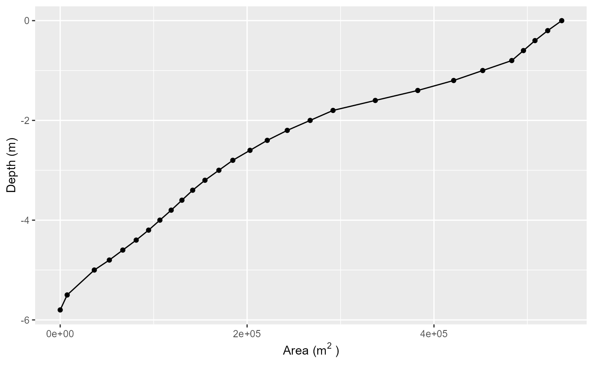
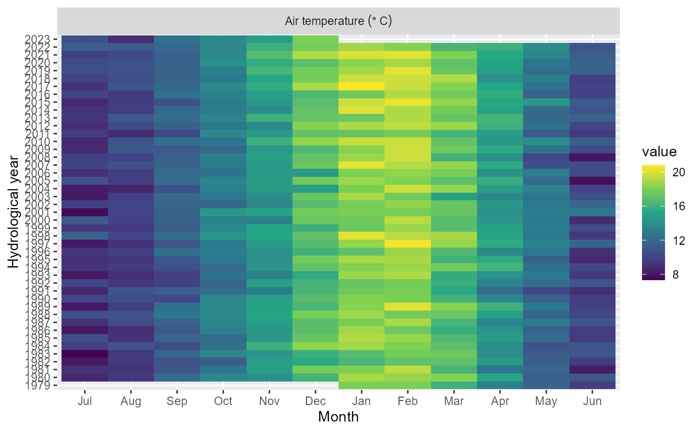

# Using the Limnotrack API

``` r
library(AEME)
library(aemetools)
library(tmap)
tmap_mode("view")
tmap_options(basemap.server = c("Esri.WorldImagery", "Esri.WorldGrayCanvas",
                                "OpenStreetMap", "Esri.WorldTopoMap"))
```

The Limnotrack API provides access to various environmental data layers,
including meteorological data from ERA5-Land. This vignette demonstrates
how to use the Limnotrack API to extract ERA5-Land data for specific
locations in New Zealand.

First, it is always good to check the status of the API to ensure it is
operational.

``` r
check_api_status()
#> API is available
#> Database connection is healthy
#> [1] TRUE
```

## Lake shape data

There are shape files for all lakes in the LimnoTrack database. These
can be accessed using the
[`get_lake_shape()`](https://limnotrack.github.io/aemetools/reference/get_lake_shape.md)
function. You need to provide the lake ID (e.g. FENZ ID or Lernzmp ID).

``` r
lake <- get_lake_shape(id = 15022)
print(lake)
#> Simple feature collection with 1 feature and 14 fields
#> Geometry type: POLYGON
#> Dimension:     XY
#> Bounding box:  xmin: 1799818 ymin: 5813534 xmax: 1800664 ymax: 5814705
#> Projected CRS: NZGD2000 / New Zealand Transverse Mercator 2000
#>   z_max  source       v  id depth_meas  region  area_ha elevation  id_final
#> 1 5.798 LERNZmp 1295012 156       TRUE Waikato 53.23887  37.99752 LID 15022
#>   gm_type              name_final       dv   z_mean lernzmp_id
#> 1    Peat Rotoroa (Hamilton Lake) 1.248453 2.412844   LID15022
#>                         geometry
#> 1 POLYGON ((1800633 5813535, ...
```

``` r
tm_shape(lake) +
  tm_borders(col = "blue", lwd = 2) +
  tm_basemap("Esri.WorldImagery")
```

## Lake catchment data

Lake catchment data can be accessed using the
[`get_catchment_data()`](https://limnotrack.github.io/aemetools/reference/get_catchment_data.md)
function. You need to provide the lake ID (e.g. FENZ ID or Lernzmp ID).
The downloaded data is a list which includes the catchment, reaches,
lakes, subcatchments, and LCDB data.

``` r
catchment <- get_catchment_data(id = 15022)
names(catchment)
#> [1] "catchment"     "reaches"       "lakes"         "subcatchments"
#> [5] "lcdb"
```

``` r
tm_shape(catchment$catchment, name = "Catchment") +
  tm_borders(col = "red", lwd = 2) +
  tm_shape(catchment$reaches, name = "Reaches") +
  tm_lines(col = "reachtype2") +
  tm_shape(catchment$lakes, name = "Lake") +
  tm_borders(col = "cyan", lwd = 2) +
  tm_shape(catchment$subcatchments, name = "Subcatchments") +
  tm_borders(col = "green", lwd = 2) +
  tm_shape(catchment$lcdb, name = "Land cover") +
  tm_fill(id = "Name_2018", fill = "Name_2018", fill_alpha = 0.5) 
```

## Aeme object

For many lakes in the LimnoTrack database, there is an associated Aeme
object that contains model parameters and other information. You can
access the Aeme object using the
[`get_aeme()`](https://limnotrack.github.io/aemetools/reference/get_aeme.md)
function. You need to provide the lake ID (e.g. FENZ ID or Lernzmp ID).

``` r
aeme <- get_aeme(id = 15022)
aeme
#>             AEME 
#> -------------------------------------------------------------------
#>   Lake
#> RotoroaHamilton (ID: LID15022); Lat: -37.8; Lon: 175.27; Elev: 38m; Depth: 5.8m;
#> Area: 536716 m2
#> -------------------------------------------------------------------
#>   Time
#> Start: 2013-07-01; Stop: 2023-06-30; Time step: 3600
#>  Spin up (days): GLM: 1095; GOTM: 1095; DYRESM: 1095
#> -------------------------------------------------------------------
#>   Configuration
#>     Model controls: Present
#>     Use biogeochemical model: 
#>           Physical   |   Biogeochemical
#> DY-CD    : Absent     |   Absent 
#> GLM-AED  : Present    |   Present
#> GOTM-WET : Present    |   Present
#> -------------------------------------------------------------------
#>   Observations
#> Lake: Present; Level: Absent
#> -------------------------------------------------------------------
#>   Input
#> Inital profile: Present; Inital depth: 5.798m; Hypsograph: Present (n=33);
#> Meteo: Present; Use longwave: TRUE; Kw: 1.075949
#> -------------------------------------------------------------------
#>   Inflows
#> Data: Present; Scaling factors: DY-CD: 1; GLM-AED: 1; GOTM-WET: 1
#> -------------------------------------------------------------------
#>   Outflows
#> Data: Present; Scaling factors: DY-CD: 1; GLM-AED: 1; GOTM-WET: 1
#> -------------------------------------------------------------------
#>   Water balance
#> Method: 2; Use: obs; Modelled: Absent; Water balance: Present
#> -------------------------------------------------------------------
#>   Parameters: 
#> Number of parameters: 0
#> -------------------------------------------------------------------
#>   Output: 
#> 
#> DY-CD:    
#> GLM-AED:  
#> GOTM-WET:
```

You can plot the lake hypsograph from the Aeme object using the
[`plot_hyps()`](https://limnotrack.com/AEME/reference/plot_hyps.html)
function.

``` r
plot_hyps(aeme, y = "depth")
```



You can also plot the meteorological data from the Aeme object using the
`plot_met()` function.

``` r
plot_met_tile(aeme, var_inp = "MET_tmpair")
```


