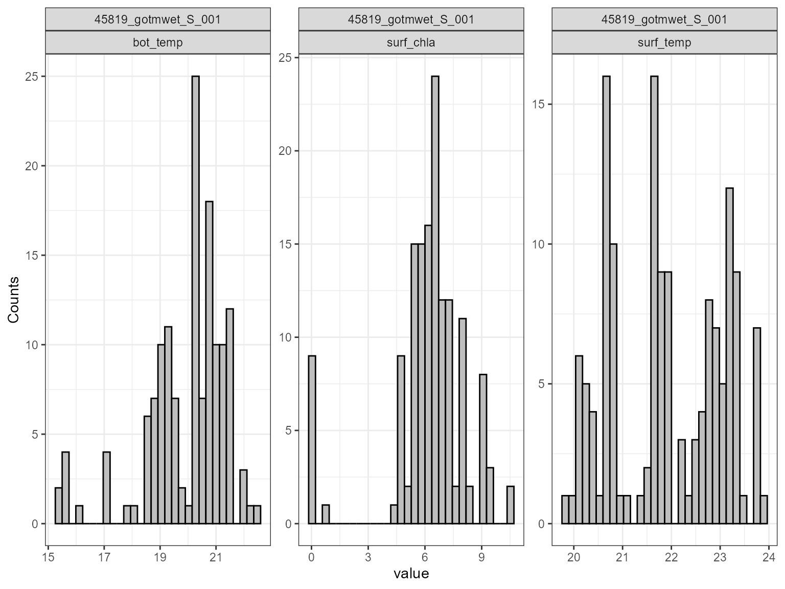
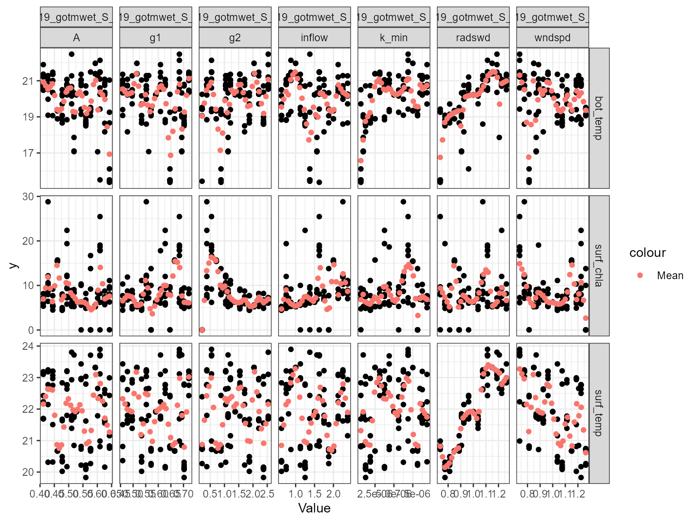
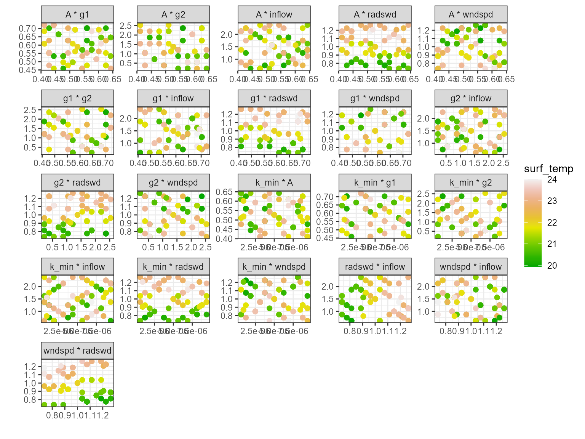
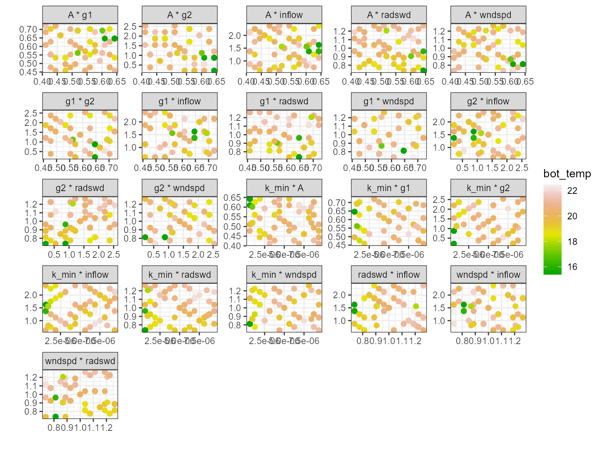
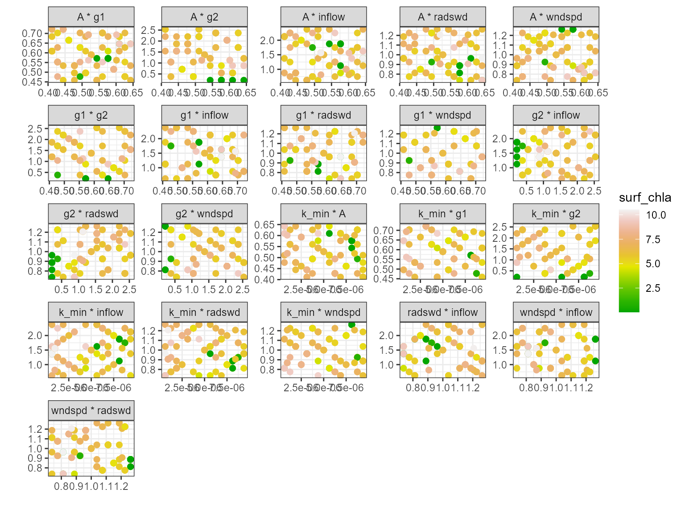

# Sensitivity Analysis

## Setup

First, we will load the `AEME` and `aemetools` package:

``` r
library(AEME)
library(aemetools)
```

Create a folder for running the example calibration setup.

``` r

tmpdir <- "sa-test"
dir.create(tmpdir, showWarnings = FALSE)
aeme_dir <- system.file("extdata/lake/", package = "AEME")
# Copy files from package into tempdir
file.copy(aeme_dir, tmpdir, recursive = TRUE)
#> [1] TRUE
path <- file.path(tmpdir, "lake")

list.files(path, recursive = TRUE)
#> [1] "aeme.yaml"            "data/hypsograph.csv"  "data/inflow_FWMT.csv"
#> [4] "data/lake_obs.csv"    "data/meteo.csv"       "data/outflow.csv"    
#> [7] "data/water_level.csv" "model_controls.csv"
```

## Build AEME ensemble

Using the `AEME` functions, we will build the AEME model setup. For this
example, we will use the `glm_aed` model. The `build_aeme` function will

``` r

aeme <- yaml_to_aeme(path = path, "aeme.yaml")
model_controls <- AEME::get_model_controls()
inf_factor = c("dy_cd" = 1, "glm_aed" = 1, "gotm_wet" = 1)
outf_factor = c("dy_cd" = 1, "glm_aed" = 1, "gotm_wet" = 1)
model <- c("gotm_wet")
aeme <- build_aeme(path = path, aeme = aeme,
                   model = model, model_controls = model_controls,
                   inf_factor = inf_factor, ext_elev = 5,
                   use_bgc = TRUE)
```

## Description of Sensitivity Analysis method

The sensitivity analysis method used here is based on the Sobol method
and uses the `sensobol` package.

This package provides several functions to conduct variance-based
uncertainty and sensitivity analysis, from the estimation of sensitivity
indices to the visual representation of the results. It implements
several state-of-the-art first and total-order estimators and allows the
computation of up to fourth-order effects, as well as of the
approximation error, in a swift and user-friendly way.

For more information on the method, see the [sensobol package
vignette](https://cran.r-project.org/web/packages/sensobol/vignettes/sensobol.html).

## Load parameters to be used for the sensitivity analysis

Parameters are loaded from the `aemetools` package within the
`aeme_parameters` dataframe. The parameters are stored in a data frame
with the following columns:

- `model`: The model name

- `file`: The file name of the model parameter file

- `name`: The parameter name

- `value`: The parameter value

- `min`: The minimum value of the parameter

- `max`: The maximum value of the parameter

Parameters to be used for the calibration. (man)

``` r
utils::data("aeme_parameters", package = "AEME")
param <- aeme_parameters |>
  dplyr::filter(file != "wdr")
param
```

| model    | file          | name                               |   value |    min |      max | group | index | module       | var_sim              |
|:---------|:--------------|:-----------------------------------|--------:|-------:|---------:|:------|:------|:-------------|:---------------------|
| glm_aed  | glm3.nml      | light/Kw                           | 5.8e-01 |  0.100 | 5.52e+00 | NA    | NA    | hydrodynamic | HYD_temp\|HYD_thmcln |
| glm_aed  | met           | MET_wndspd                         | 1.0e+00 |  0.700 | 1.30e+00 | NA    | NA    | hydrodynamic | HYD_temp\|HYD_thmcln |
| glm_aed  | met           | MET_radswd                         | 1.0e+00 |  0.700 | 1.30e+00 | NA    | NA    | hydrodynamic | HYD_temp             |
| glm_aed  | glm3.nml      | mixing/coef_mix_conv               | 1.4e-01 |  0.100 | 2.00e-01 | NA    | NA    | hydrodynamic | HYD_thmcln           |
| glm_aed  | glm3.nml      | mixing/coef_wind_stir              | 2.1e-01 |  0.200 | 3.00e-01 | NA    | NA    | hydrodynamic | HYD_thmcln           |
| glm_aed  | glm3.nml      | mixing/coef_mix_shear              | 1.4e-01 |  0.100 | 2.00e-01 | NA    | NA    | hydrodynamic | HYD_thmcln           |
| glm_aed  | glm3.nml      | mixing/coef_mix_turb               | 5.6e-01 |  0.200 | 7.00e-01 | NA    | NA    | hydrodynamic | HYD_thmcln           |
| glm_aed  | glm3.nml      | mixing/coef_mix_hyp                | 7.4e-01 |  0.400 | 8.00e-01 | NA    | NA    | hydrodynamic | HYD_thmcln           |
| glm_aed  | inf           | inflow                             | 1.0e+00 |  0.500 | 2.50e+00 | NA    | NA    | hydrodynamic | LKE_lvlwtr           |
| gotm_wet | gotm.yaml     | turbulence/turb_param/k_min        | 6.0e-07 |  0.000 | 1.00e-05 | NA    | NA    | hydrodynamic | HYD_thmcln           |
| gotm_wet | gotm.yaml     | light_extinction/A/constant_value  | 5.5e-01 |  0.395 | 6.59e-01 | NA    | NA    | hydrodynamic | HYD_temp\|HYD_thmcln |
| gotm_wet | gotm.yaml     | light_extinction/g1/constant_value | 5.9e-01 |  0.440 | 7.40e-01 | NA    | NA    | hydrodynamic | HYD_temp\|HYD_thmcln |
| gotm_wet | gotm.yaml     | light_extinction/g2/constant_value | 2.0e-01 |  0.050 | 2.70e+00 | NA    | NA    | hydrodynamic | HYD_temp\|HYD_thmcln |
| gotm_wet | met           | MET_wndspd                         | 1.0e+00 |  0.700 | 1.30e+00 | NA    | NA    | hydrodynamic | HYD_temp\|HYD_thmcln |
| gotm_wet | met           | MET_radswd                         | 1.0e+00 |  0.700 | 1.30e+00 | NA    | NA    | hydrodynamic | HYD_temp             |
| gotm_wet | inf           | inflow                             | 1.0e+00 |  0.500 | 2.50e+00 | NA    | NA    | hydrodynamic | LKE_lvlwtr           |
| dy_cd    | cfg           | light_extinction_coefficient/7     | 9.0e-01 |  0.100 | 1.40e+00 | NA    | NA    | hydrodynamic | HYD_temp\|HYD_thmcln |
| dy_cd    | dyresm3p1.par | vert_mix_coeff/15                  | 2.0e+02 | 50.000 | 7.50e+02 | NA    | NA    | hydrodynamic | HYD_thmcln           |
| dy_cd    | met           | MET_wndspd                         | 1.0e+00 |  0.700 | 1.30e+00 | NA    | NA    | hydrodynamic | HYD_temp\|HYD_thmcln |
| dy_cd    | met           | MET_radswd                         | 1.0e+00 |  0.700 | 1.30e+00 | NA    | NA    | hydrodynamic | HYD_temp             |
| dy_cd    | inf           | inflow                             | 1.0e+00 |  0.500 | 2.50e+00 | NA    | NA    | hydrodynamic | LKE_lvlwtr           |

## Sensitivity analysis setup

### Define fitness function

First, we will define a function for the sensitivity analysis function
to use to calculate the sensitivity of the model. This function takes a
dataframe as an argument. The dataframe contains the observed data
(`obs`) and the modelled data (`model`). The function should return a
single value.

Here we use the model mean.

``` r
# Function to calculate mean model output
fit <- function(df) {
  mean(df$model)
}
```

Different functions can be applied to different variables. For example,
we can use the mean for water temperature and median for chloophyll-a.

``` r
# Function to calculate median model output
fit2 <- function(df) {
  median(df$model)
}
```

Then these would be combined into a named list of functions which will
be passed to the `sa_aeme` function. They are named according to the
target variable.

``` r

# Create list of functions
FUN_list <- list(HYD_temp = fit, PHY_tchla = fit2)
```

### Define control parameters

Next, we will define the control parameters for the sensitivity
analysis. The control parameters are generated using `create_control`
and are then passed to the `sa_aeme` function. The control parameters
for the sensitivity analysis are as follows:

``` r
?create_sa_control
```

|                   |                 |
|-------------------|----------------:|
| create_sa_control | R Documentation |

## Create control list for sensitivity analysis

### Arguments

|             |                                                                                                    |
|-------------|----------------------------------------------------------------------------------------------------|
| `file_type` | Character. Output type: `"csv"` or `"db"`. Default `"db"`.                                         |
| `file_name` | Character. Output file name. Defaults to `"results.db"` (db) or `"simulation_metadata.csv"` (csv). |
| `file_dir`  | Character. Output directory. Default `"calib_sa"`.                                                 |
| `na_value`  | Numeric. Replacement for `NA`. Default `999`.                                                      |
| `parallel`  | Logical. Run in parallel? Default `TRUE`.                                                          |
| `ncore`     | Integer. Number of cores if `parallel = TRUE`. Default `parallel::detectCores() - 1`.              |
| `timeout`   | Numeric. Max runtime in seconds. Default `Inf`.                                                    |
| `N`         | Integer. Base sample size.                                                                         |
| `vars_sim`  | Named list describing output variables.                                                            |
| `...`       | Must be empty. Additional arguments are not allowed.                                               |

Here is an example for examining surface temperature (surf_temp) in the
months December to February, bottom temperature (bot_temp), (10 - 13 m)
and also total chlorophyll-a (PHY_tchla) at the surface (0 - 2 m) during
the summer period.

``` r
ctrl <- create_sa_control(N = 2^4, ncore = 2, na_value = 999,
                          parallel = TRUE, file_name = "results.db",
                          vars_sim = list(
                            surf_temp = list(var = "HYD_temp",
                                             month = c(12, 1:2),
                                             depth_range = c(0, 2) 
                            ),
                            bot_temp = list(var = "HYD_temp",
                                            month = c(12, 1:2),
                                            depth_range = c(10, 13)
                            ),
                            surf_chla = list(var = "PHY_tchla",
                                             month = c(12, 1:2),
                                             depth_range = c(0, 2)
                            )
                          )
)
```

## Run sensitivity analysis

Once we have defined the fitness function, control parameters and
variables, we can run the sensitivity analysis. The `sa_aeme` function
takes the following arguments:

``` r
?sa_aeme
```

|         |                 |
|---------|----------------:|
| sa_aeme | R Documentation |

## Run sensitivity analysis on AEME model parameters

### Arguments

|                  |                                                                                                                                                                                                    |
|------------------|----------------------------------------------------------------------------------------------------------------------------------------------------------------------------------------------------|
| `aeme`           | aeme; object.                                                                                                                                                                                      |
| `model`          | vector; of models to be used. Can be 'dy_cd', 'glm_aed', 'gotm_wet'.                                                                                                                               |
| `param`          | dataframe; of parameters read in from a csv file. Requires the columns c("model", "file", "name", "value", "min", "max", "log")                                                                    |
| `FUN_list`       | list of functions; named according to the variables in the `vars_sim`. Funtions are of the form `⁠function(df)⁠` which will be used to calculate model fit. If NULL, uses mean absolute error (MAE). |
| `path`           | filepath; where input files are located relative to the current working directory.                                                                                                                 |
| `model_controls` | dataframe; of configuration loaded from "model_controls.csv".                                                                                                                                      |
| `ctrl`           | list; of controls for sensitivity analysis function created using the `create_control` function. See create_control for more details.                                                              |
| `param_df`       | dataframe; of parameters to be used in the calibration. Requires the columns c("model", "file", "name", "value", "min", "max"). This is used to restart from a previous calibration.               |

The `sa_aeme` function writes the results to the file specified. The
`sa_aeme` function returns the `sim_id` of the run.

``` r
# Run sensitivity analysis AEME model
sim_id <- sa_aeme(aeme = aeme, path = path, param = param,
                  model = model, ctrl = ctrl, FUN_list = FUN_list)
#> ℹ Extracting variable indices for "gotm_wet" modelled 
#> variables "HYD_temp" and "PHY_tchla". [2026-03-04 03:13:29]
#> ✔ Variable indices extracted for "gotm_wet". 
#> [2026-03-04 03:13:34]
#> ℹ Starting parallel sensitivity analysis for 
#> "gotm_wet" using 2 cores with 
#> 144 parameter sets. 
#> [2026-03-04 03:13:34]
#>        turbulence/turb_param/k_min light_extinction/A/constant_value
#> mean                     4.851e-06                           0.52760
#> median                   5.000e-06                           0.52700
#> sd                       2.799e-06                           0.06984
#>        light_extinction/g1/constant_value light_extinction/g2/constant_value
#> mean                              0.59460                             1.3590
#> median                            0.59000                             1.2920
#> sd                                0.08189                             0.6979
#>        MET_wndspd MET_radswd inflow
#> mean       0.9965     0.9983 1.4930
#> median     1.0000     1.0000 1.5000
#> sd         0.1619     0.1606 0.5311
#> ✔ Parallel sensitivity analysis for 
#> "gotm_wet" completed. 
#> [2026-03-04 03:21:48]
#> Writing output for generation 1 to results.db with sim ID:
#> "45819_gotmwet_S_001" [2026-03-04 03:21:48]
```

## Reading sensitivity analysis results

The sensitivity results can be read in using the `read_sa` function.
This function takes the following arguments:

- `ctrl`: The control parameters used for the sensitivity analysis.
- `model`: The model used for the sensitivity analysis.
- `path`: The path to the directory where the model is configuration is.

``` r
# Read in sensitivity analysis results
sa_res <- read_sa(ctrl = ctrl, sim_id = sim_id, R = 10^3)
names(sa_res)
#> [1] "45819_gotmwet_S_001"
```

The `read_sa` function returns a list for each simulation id provided.
This list contains the following elements:

- `df`: dataframe of the sensitivity analysis results. The dataframe
  contains the model, generation, index (model run), parameter name,
  parameter value, fitness value and the median fitness value for each
  generation.

``` r
head(sa_res[[1]]$df)
```

| sim_id              | model    | run | gen | parameter_name                       | parameter_value | fit_type  | fit_value | label |
|:--------------------|:---------|----:|----:|:-------------------------------------|----------------:|:----------|----------:|:------|
| 45819_gotmwet_S_001 | gotm_wet |   1 |   1 | NA/turbulence/turb_param/k_min       |        0.000005 | surf_temp |  21.91650 | k_min |
| 45819_gotmwet_S_001 | gotm_wet |   1 |   1 | NA/turbulence/turb_param/k_min       |        0.000005 | bot_temp  |  20.23140 | k_min |
| 45819_gotmwet_S_001 | gotm_wet |   1 |   1 | NA/turbulence/turb_param/k_min       |        0.000005 | surf_chla |   6.25585 | k_min |
| 45819_gotmwet_S_001 | gotm_wet |   1 |   1 | NA/light_extinction/A/constant_value |        0.527000 | surf_temp |  21.91650 | A     |
| 45819_gotmwet_S_001 | gotm_wet |   1 |   1 | NA/light_extinction/A/constant_value |        0.527000 | bot_temp  |  20.23140 | A     |
| 45819_gotmwet_S_001 | gotm_wet |   1 |   1 | NA/light_extinction/A/constant_value |        0.527000 | surf_chla |   6.25585 | A     |

- `sobol_indices`: list of the Sobol indices for each variable an it’s
  senstivity to the parameters.

``` r
sa_res[[1]]$sobol_indices
#> $surf_temp
#> 
#> First-order estimator: saltelli | Total-order estimator: jansen 
#> 
#> Total number of model runs: 144 
#> 
#> Sum of first order indices: 1.006097 
#>          original         bias  std.error        low.ci     high.ci sensitivity
#>             <num>        <num>      <num>         <num>       <num>      <char>
#>  1:  0.5239187106 -0.021517726 4.81427862  -8.890376264  9.98124914          Si
#>  2: -0.0001242286  0.067368700 1.21215715  -2.443277285  2.30829143          Si
#>  3:  0.2738016194 -0.060201388 3.84159936  -7.195393383  7.86339940          Si
#>  4:  0.2643026253 -0.134931846 6.34017288 -12.027276039 12.82574498          Si
#>  5: -0.1305800824  0.050514790 5.41472709 -10.793764952 10.43157521          Si
#>  6: -1.0174274041 -0.075138768 5.93974653 -12.583977905 10.69940063          Si
#>  7:  1.0922061438 -0.005839709 6.85152018 -12.330686930 14.52677864          Si
#>  8:  0.4649087956  0.034390471 0.22615783  -0.012742872  0.87377952          Ti
#>  9:  0.0291207091  0.002539864 0.01153937   0.003964096  0.04919759          Ti
#> 10:  0.2970771772  0.025941990 0.15031713  -0.023480978  0.56575135          Ti
#> 11:  0.7390505326  0.049865126 0.24264630   0.213607400  1.16476341          Ti
#> 12:  0.5027757524  0.047191569 0.17913239   0.104491152  0.80667722          Ti
#> 13:  0.6202750858  0.056890519 0.20767871   0.156341782  0.97042735          Ti
#> 14:  0.8483240934  0.055080880 0.29690898   0.211312311  1.37517412          Ti
#>     parameters
#>         <char>
#>  1:      k_min
#>  2:          A
#>  3:         g1
#>  4:         g2
#>  5:     wndspd
#>  6:     radswd
#>  7:     inflow
#>  8:      k_min
#>  9:          A
#> 10:         g1
#> 11:         g2
#> 12:     wndspd
#> 13:     radswd
#> 14:     inflow
#> 
#> $bot_temp
#> 
#> First-order estimator: saltelli | Total-order estimator: jansen 
#> 
#> Total number of model runs: 144 
#> 
#> Sum of first order indices: 9.992956 
#>       original         bias std.error      low.ci    high.ci sensitivity
#>          <num>        <num>     <num>       <num>      <num>      <char>
#>  1:  0.1951079  0.707183972 3.9245468 -8.20404650  7.1798943          Si
#>  2: -0.1751040  0.536594105 2.6426462 -5.89118940  4.4677932          Si
#>  3:  0.7960785  0.650966614 3.7180097 -7.14205317  7.4322770          Si
#>  4:  4.3683312  0.193709103 4.6855220 -5.00883227 13.3580765          Si
#>  5:  0.9929943  0.467225128 3.9343924 -7.18549821  8.2370366          Si
#>  6:  1.9296969  0.398727034 3.8259123 -5.96768057  9.0296202          Si
#>  7:  1.8858516  0.400347544 4.4207862 -7.17907757 10.1500858          Si
#>  8:  0.5521804  0.029323858 0.2506345  0.03162193  1.0140911          Ti
#>  9:  0.3174816 -0.005799624 0.1889547 -0.04706321  0.6936257          Ti
#> 10:  0.3994266  0.049714567 0.1952485 -0.03296803  0.7323922          Ti
#> 11:  0.8498165  0.053628390 0.3385209  0.13269932  1.4596769          Ti
#> 12:  0.4649502  0.054463104 0.1876114  0.04277549  0.7781986          Ti
#> 13:  0.3713559  0.073272981 0.2149951 -0.12329976  0.7194655          Ti
#> 14:  0.5303853  0.087078572 0.2361150 -0.01947017  0.9060836          Ti
#>     parameters
#>         <char>
#>  1:      k_min
#>  2:          A
#>  3:         g1
#>  4:         g2
#>  5:     wndspd
#>  6:     radswd
#>  7:     inflow
#>  8:      k_min
#>  9:          A
#> 10:         g1
#> 11:         g2
#> 12:     wndspd
#> 13:     radswd
#> 14:     inflow
#> 
#> $surf_chla
#> 
#> First-order estimator: saltelli | Total-order estimator: jansen 
#> 
#> Total number of model runs: 144 
#> 
#> Sum of first order indices: 3.101766 
#>        original          bias std.error      low.ci   high.ci sensitivity
#>           <num>         <num>     <num>       <num>     <num>      <char>
#>  1:  0.08955763  0.0664530768 0.4471491 -0.85329162 0.8995007          Si
#>  2:  0.85489813  0.0239149914 0.9429402 -1.01714573 2.6791120          Si
#>  3:  0.68315885 -0.0186098479 0.7820833 -0.83108642 2.2346238          Si
#>  4: -0.15776731 -0.1466637858 0.9185640 -1.81145588 1.7892488          Si
#>  5:  0.79962026  0.0013477188 0.8615702 -0.89037412 2.4869192          Si
#>  6:  0.28086134 -0.0769042051 0.7365873 -1.08591907 1.8014501          Si
#>  7:  0.55143680 -0.0557278970 0.8900317 -1.13726539 2.3515948          Si
#>  8:  0.11923421  0.0321431991 0.1369800 -0.18138494 0.3555670          Ti
#>  9:  0.75992005  0.0476112085 0.4334899 -0.13731583 1.5619335          Ti
#> 10:  0.42054008  0.0123442152 0.3483112 -0.27448146 1.0908732          Ti
#> 11:  0.61550689  0.0234422909 0.1854208  0.22864655 0.9554826          Ti
#> 12:  0.63192568  0.0008683431 0.3121615  0.01923206 1.2428826          Ti
#> 13:  0.43999402 -0.0003716049 0.1475534  0.15116624 0.7295650          Ti
#> 14:  0.60439755  0.0148085094 0.2264933  0.14567042 1.0335077          Ti
#>     parameters
#>         <char>
#>  1:      k_min
#>  2:          A
#>  3:         g1
#>  4:         g2
#>  5:     wndspd
#>  6:     radswd
#>  7:     inflow
#>  8:      k_min
#>  9:          A
#> 10:         g1
#> 11:         g2
#> 12:     wndspd
#> 13:     radswd
#> 14:     inflow
```

- `sobol_dummy`: list of the Sobol indices for the dummy parameter.

``` r
sa_res[[1]]$sobol_dummy
#> $surf_temp
#>   original          bias  std.error   low.ci  high.ci sensitivity parameters
#> 1 1.974597 -8.131868e-05 0.03919692 1.897853 2.051503          Si      dummy
#> 2 0.000000  7.269674e-04 0.42332393 0.000000 0.000000          Ti      dummy
#> 
#> $bot_temp
#>   original        bias  std.error   low.ci   high.ci sensitivity parameters
#> 1  1.79211 0.004648471 0.09625484 1.598806 1.9761179          Si      dummy
#> 2  0.00000 0.003624849 0.68230385 0.000000 0.3672023          Ti      dummy
#> 
#> $surf_chla
#>    original       bias std.error low.ci   high.ci sensitivity parameters
#> 1 0.3410965 0.06636077 0.1872000      0 0.6416410          Si      dummy
#> 2 0.0000000 0.01721546 0.7126491      0 0.9773963          Ti      dummy
```

## Visualising sensitivity analysis results

The sensitivity analysis results can be visualised in different ways
using the functions: `plot_uncertainty`, `plot_scatter` and
`plot_multiscatter`. These plots are based on the output plots from the
`sensobol` package.

These functions take the following argument:

- `sa_res`: The sensitivity analysis results returned from the `read_sa`
  function.

### Uncertainty plot

The `plot_uncertainty` function plots the distribution of the model
output for each variable.

``` r
# Plot sensitivity analysis results
plot_uncertainty(sa_res)
#> Dropped 0 NA's from 432 rows for sim_id 45819_gotmwet_S_001
```



### Scatter plot

The `plot_scatter` function plots the model output against the parameter
value for each variable. This is useful for identifying relationships
between the model output and the parameter value. For example, the plot
below shows that there is a relationship between the model surface
temperature (surf_temp\_) and the parameter value of the scaling factor
for shortwave radiation (MET_radswd), and also for surface chlorophyll-a
(surf_chla) and the light extinction coefficient (light.Kw). When there
is a low parameter value for Kw, the model chlorophyll-a is higher.

``` r
plot_scatter(sa_res)
```



### Multi-scatter plot

The `plot_multiscatter` function plots the parameters against each other
for each variable. The parameter on top is the x-axis and the parameter
below is the y-axis. This is useful for identifying relationships
between the parameters and response variable.

``` r
pl <- plot_multiscatter(sa_res)

pl[[1]][1]
#> $surf_temp
```



``` r

pl[[1]][2]
#> $bot_temp
```



``` r

pl[[1]][3]
#> $surf_chla
```


