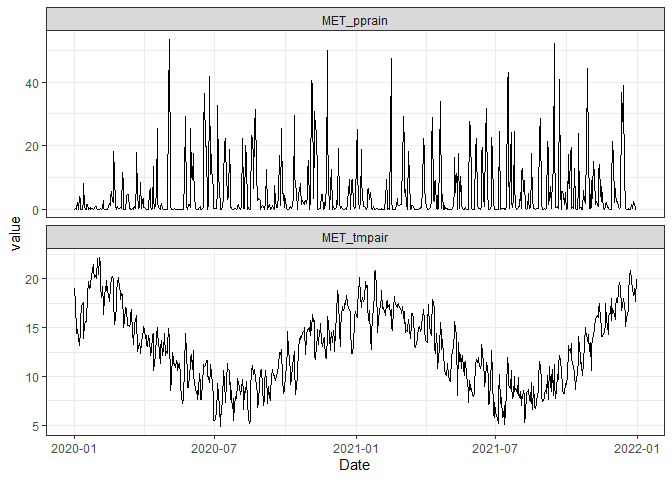

# aemetools

aemetools is designed to work with
[AEME](https://github.com/limnotrack/AEME/). It contains a range of
functions to assist in setting up simulations for a lake site.

## Development

This package was developed by [LimnoTrack](http://limnotrack.com/) as
part of the [Lake Ecosystem Research New Zealand Modelling
Platform](https://limnotrack.shinyapps.io/LERNZmp/) (LERNZmp) project.
[](http://limnotrack.com/)

## Overview

Currently, this package can be used to:

- Download meteorological data from
  [ERA5-Land](https://www.ecmwf.int/en/era5-land) for any point in New
  Zealand from 1980-2023, or download ERA5-Land GRIB files for any area
  in the world.
- Set up and run hydrological simulations using the suite of models from
  the [`airGR`](https://hydrogr.github.io/airGR/) package using
  catchment, reach and lake data.
- Conduct a sensitivity analysis on the parameters for the AEME models.
- Calibrate the AEME models using lake observational data.

## Installation

You can install the development version of aemetools from
[GitHub](https://github.com/) with:

``` r

# install.packages("devtools")
devtools::install_github("limnotrack/aemetools")
```

``` r

library(aemetools)
```

### Download NZ point meteorological data

Currently, there is ERA5-Land data (~9km grid spacing) archived for New
Zealand (166.5/-46.6/178.6/-34.5) for the time period 1980-2023 with the
main meteorological variables (air temperature, dewpoint temperature,
wind u-vector at 10m, wind v-vector at 10m, total precipitation,
snowfall, surface level pressure, downwelling shortwave radiation,
downwelling longwave radiation) required to drive hydrological and
hydrodynamic models. This can be easily downloaded using the example
below. There is a `parallel` switch which allows you to use multiple
cores on your computer to speed up the download.

``` r


lon <- 176.2717
lat <- -38.079
vars <- c("MET_tmpair", "MET_pprain")

met <- get_era5_land_point_nz(lat = lat, lon = lon, years = 2020:2021,
                      vars = vars)
summary(met)
#>       Date              MET_tmpair       MET_pprain      
#>  Min.   :2020-01-01   Min.   : 4.848   Min.   : 0.00000  
#>  1st Qu.:2020-07-01   1st Qu.: 9.699   1st Qu.: 0.08205  
#>  Median :2020-12-31   Median :12.729   Median : 0.83960  
#>  Mean   :2020-12-31   Mean   :12.845   Mean   : 5.10542  
#>  3rd Qu.:2021-07-01   3rd Qu.:15.782   3rd Qu.: 5.73165  
#>  Max.   :2021-12-31   Max.   :22.176   Max.   :53.44960
```

``` r


library(ggplot2)
library(tidyr)

met |> 
  pivot_longer(cols = c(MET_tmpair, MET_pprain)) |> 
  ggplot(aes(x = Date, y = value)) +
  geom_line() +
  facet_wrap(~name, scales = "free_y", ncol = 1) +
  theme_bw()
```



### Calibrate AEME model

See the vignette
[here](https://limnotrack.github.io/aemetools/articles/calibrate-aeme.html).

### Sensitivity analysis for AEME models

See the vignette
[here](https://limnotrack.github.io/aemetools/articles/sensitivity-analysis.html).

### Run hydrological models

See the vignette
[here](https://limnotrack.github.io/aemetools/articles/run-gr4j.html).
